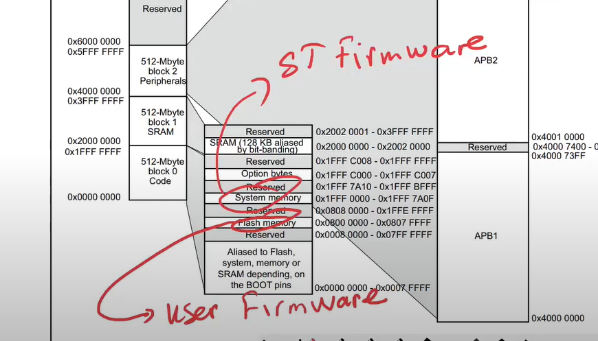
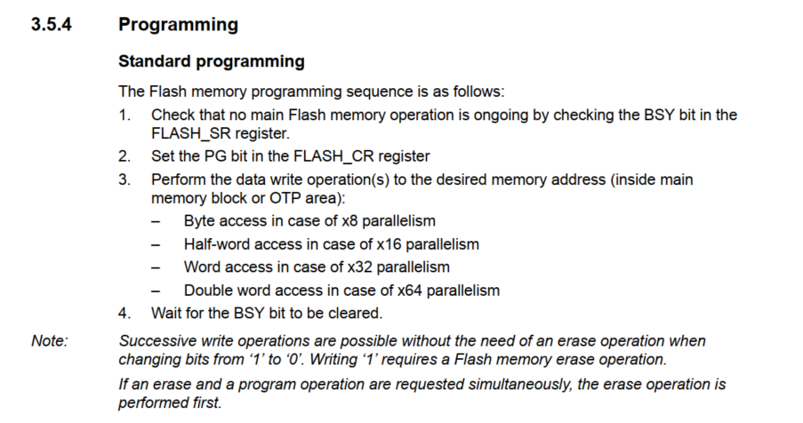
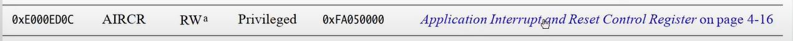
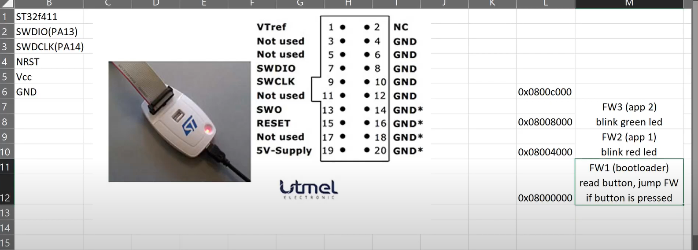
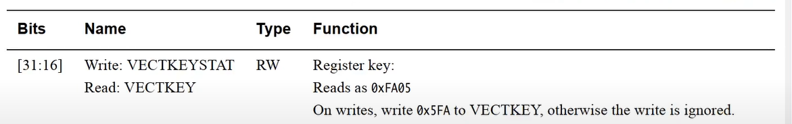

# Thao tác với bộ nhớ FLASH trên STM32

## Tổng quan
Dự án này minh họa cách làm việc với bộ nhớ FLASH trên vi điều khiển STM32. FLASH là bộ nhớ không bay hơi, cho phép lưu trữ dữ liệu ngay cả khi mất điện. Trên STM32, FLASH được tổ chức thành các trang (pages) và mỗi trang có kích thước cố định.

## Cấu trúc bộ nhớ FLASH
- Bộ nhớ FLASH được chia thành các trang (pages)
- Mỗi trang có kích thước cố định (thường là 1KB hoặc 2KB tùy model)
- Địa chỉ FLASH bắt đầu từ 0x08000000
- Có thể đọc/ghi từng byte, half-word (16-bit) hoặc word (32-bit)

## Tính năng
- Khởi tạo bộ nhớ FLASH
- Xóa trang FLASH
- Thao tác ghi FLASH
- Thao tác đọc FLASH
- Xử lý lỗi và xác minh

## Yêu cầu
- STM32CubeIDE hoặc IDE tương thích
- Thư viện STM32 HAL
- Vi điều khiển STM32F4xx hoặc tương thích

## Cách sử dụng
1. Khởi tạo bộ nhớ FLASH:
```c
HAL_FLASH_Unlock();
```

2. Xóa trang FLASH:
```c
FLASH_EraseInitTypeDef EraseInitStruct;
EraseInitStruct.TypeErase = FLASH_TYPEERASE_PAGES;
EraseInitStruct.PageAddress = FLASH_PAGE_ADDRESS;
EraseInitStruct.NbPages = 1;
HAL_FLASHEx_Erase(&EraseInitStruct, &PAGEError);
```

3. Ghi vào FLASH:
```c
// Ghi từng word (32-bit)
HAL_FLASH_Program(FLASH_TYPEPROGRAM_WORD, address, data);

// Ghi từng half-word (16-bit)
HAL_FLASH_Program(FLASH_TYPEPROGRAM_HALFWORD, address, data);

// Ghi từng byte (8-bit)
HAL_FLASH_Program(FLASH_TYPEPROGRAM_BYTE, address, data);
```

4. Đọc từ FLASH:
```c
// Đọc word (32-bit)
uint32_t data = *(__IO uint32_t*)address;

// Đọc half-word (16-bit)
uint16_t data = *(__IO uint16_t*)address;

// Đọc byte (8-bit)
uint8_t data = *(__IO uint8_t*)address;
```

5. Khóa FLASH:
```c
HAL_FLASH_Lock();
```

## Lưu ý quan trọng
- Luôn mở khóa FLASH trước khi thực hiện thao tác
- Khóa FLASH sau khi thực hiện thao tác
- Xác minh các thao tác ghi
- Xử lý lỗi phù hợp
- Cẩn thận với địa chỉ trang
- FLASH chỉ có thể ghi từ 1 thành 0, không thể ghi từ 0 thành 1
- Phải xóa trang trước khi ghi lại
- Địa chỉ ghi phải được căn chỉnh (aligned) theo kiểu dữ liệu

## Cân nhắc an toàn
- Sao lưu dữ liệu quan trọng trước khi thực hiện thao tác FLASH
- Sử dụng kiểm tra lỗi phù hợp
- Tuân theo hướng dẫn lập trình FLASH của STM32
- Cân nhắc độ ổn định nguồn trong quá trình thao tác
- Không thực hiện thao tác FLASH trong các ngắt
- Đảm bảo không ghi đè lên vùng chứa chương trình

## Giấy phép
Dự án này là mã nguồn mở và được cung cấp dưới Giấy phép MIT.


## Sector Erase

xóa sector thì sẽ xóa toàn bộ sector không xóa từng bit được

## Programming


## Reset control


có thanh ghi 2 có reset system

cách mở khóa
