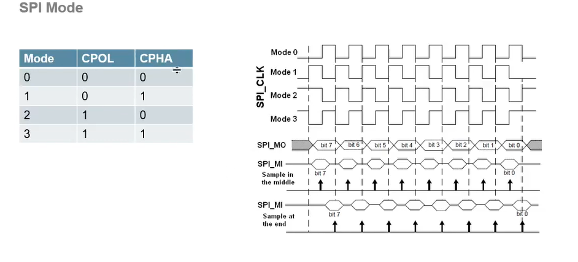

# SPI (Serial Peripheral Interface)

SPI (Serial Peripheral Interface) là một chuẩn giao tiếp nối tiếp đồng bộ, thường được sử dụng để truyền dữ liệu giữa vi điều khiển và các thiết bị ngoại vi như cảm biến, bộ nhớ, màn hình, v.v. SPI sử dụng bốn đường tín hiệu chính:

- **MOSI (Master Out Slave In)**: Dữ liệu từ Master đến Slave
- **MISO (Master In Slave Out)**: Dữ liệu từ Slave đến Master
- **SCK (Serial Clock)**: Xung nhịp do Master tạo ra
- **SS/CS (Slave Select/Chip Select)**: Chọn thiết bị Slave

SPI có tốc độ truyền dữ liệu cao, cấu trúc đơn giản và dễ triển khai trong các ứng dụng nhúng.

---

## Hướng dẫn giao tiếp SPI trên STM32

### 1. Giới thiệu SPI
SPI (Serial Peripheral Interface) là giao tiếp nối tiếp đồng bộ, thường dùng để kết nối vi điều khiển với các ngoại vi như cảm biến, bộ nhớ, màn hình, v.v.

### 2. Các chân tín hiệu SPI
- **MOSI (Master Out Slave In):** Truyền dữ liệu từ Master đến Slave
- **MISO (Master In Slave Out):** Truyền dữ liệu từ Slave đến Master
- **SCK (Serial Clock):** Xung nhịp do Master tạo ra
- **SS/CS (Slave Select/Chip Select):** Chọn thiết bị Slave

### 3. Cấu hình SPI trên STM32 (theo video)
- Sử dụng phần mềm STM32CubeMX để cấu hình chân SPI (ví dụ: SPI1, SPI2).
- Chọn chế độ Master hoặc Slave tùy ứng dụng.
- Thiết lập tốc độ baudrate, chế độ clock polarity/phase (CPOL/CPHA).
- Kích hoạt các chân MOSI, MISO, SCK, NSS tương ứng với vi điều khiển.

### 4. Lập trình SPI với HAL Library
- Khởi tạo SPI bằng hàm `HAL_SPI_Init()`.
- Gửi dữ liệu: `HAL_SPI_Transmit()`
- Nhận dữ liệu: `HAL_SPI_Receive()`
- Gửi và nhận đồng thời: `HAL_SPI_TransmitReceive()`

#### Ví dụ gửi dữ liệu:
```c
uint8_t data = 0x55;
HAL_SPI_Transmit(&hspi1, &data, 1, 100);
```

#### Ví dụ nhận dữ liệu:
```c
uint8_t received;
HAL_SPI_Receive(&hspi1, &received, 1, 100);
```

### 5. Lưu ý khi sử dụng SPI
- Đảm bảo cấu hình đúng tốc độ và chế độ clock giữa Master và Slave.
- Kiểm tra kết nối dây đúng thứ tự các chân.
- Sử dụng trở kéo lên/kéo xuống nếu cần thiết cho chân CS.

---

## Giới thiệu Giao tiếp Ngoại vi Nối tiếp (SPI)

- **SPI là gì:** Giao tiếp Ngoại vi Nối tiếp (SPI) là một giao tiếp nối tiếp **đồng bộ**.
- *(SPI hoạt động theo cách hơi khác biệt. Đây là một bus dữ liệu "đồng bộ", nghĩa là nó sử dụng các đường riêng biệt cho dữ liệu và một đường "xung nhịp" để giữ cho cả hai phía luôn đồng bộ hoàn hảo.)*

### Kết nối SPI

```
Master                Slave
------                -----
SCLK   -------------- SCLK
MOSI   -------------- MOSI
MISO   -------------- MISO
SS     -------------- SS
```

---

### SPI MODE

