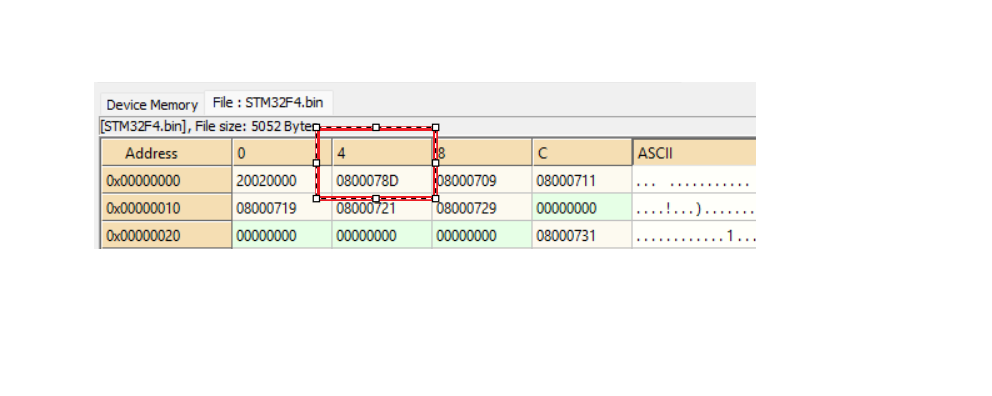
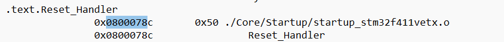
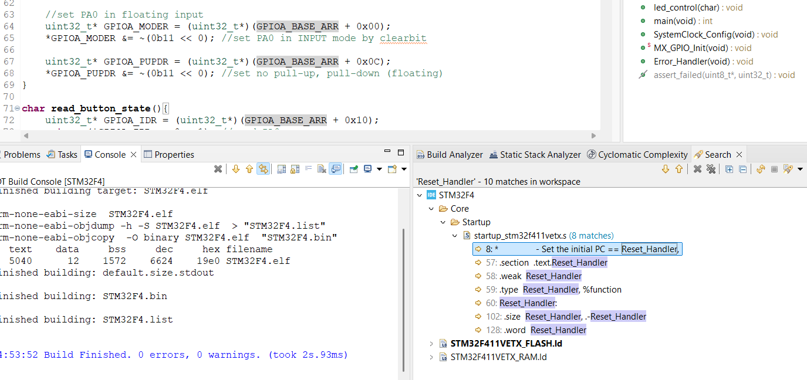
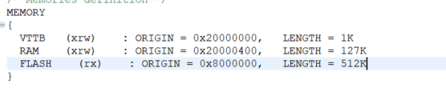
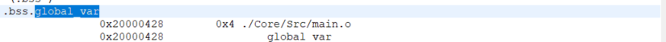

# Bài 2: EXTI (External Interrupts)

## 1. Tổng quan về EXTI
   - EXTI là gì?
     * External Interrupt/Event Controller
     * Cho phép tạo ngắt từ các nguồn bên ngoài
     * 23 đường EXTI (EXTI0 đến EXTI22)
     * Mỗi GPIO pin có thể kết nối với một line EXTI tương ứng

   - Đặc điểm của EXTI
     * Có thể cấu hình cạnh kích hoạt (rising/falling)
     * Có thể hoạt động ở chế độ event hoặc interrupt
     * Độc lập với các chức năng GPIO khác
     * Có thể đánh thức MCU từ sleep mode

## 2. Cấu trúc EXTI
   - EXTI line selection
   - Edge trigger selection
   - Interrupt mask register
   - Event mask register
   - Pending register

## 3. Các bước cấu hình EXTI
   a. Cấu hình GPIO
      * Enable clock cho GPIO port
      * Cấu hình pin là input mode
      * Cấu hình pull-up/pull-down nếu cần
   
   b. Cấu hình SYSCFG
      * Enable clock cho SYSCFG
      * Chọn GPIO port cho EXTI line (SYSCFG_EXTICR)
   
   c. Cấu hình EXTI
      * Chọn cạnh kích hoạt (EXTI_RTSR/FTSR)
      * Enable interrupt hoặc event (EXTI_IMR/EMR)
      * Clear pending flag nếu có
   
   d. Cấu hình NVIC
      * Set priority cho interrupt
      * Enable interrupt trong NVIC

## 4. Các thanh ghi quan trọng
   - SYSCFG_EXTICR1-4: External interrupt configuration
   - EXTI_IMR: Interrupt mask register
   - EXTI_EMR: Event mask register
   - EXTI_RTSR: Rising trigger selection
   - EXTI_FTSR: Falling trigger selection
   - EXTI_PR: Pending register

## 5. Xử lý ngắt EXTI
   - Kiểm tra pending flag
   - Thực hiện công việc cần thiết
   - Clear pending flag
   - Debouncing nếu cần (với nút nhấn)

## 6. Lưu ý quan trọng
   - Mỗi EXTI line chỉ kết nối được với một GPIO pin
   - Cần xử lý ngắt nhanh để tránh miss event
   - Nên có debouncing với input cơ học
   - Clear pending flag trước khi enable interrupt

## 7. Luồng hoạt động của EXTI
   Sơ đồ khối của EXTI:
   ```
   ┌──────────────────────────────────────────────────────┐
   │                      STM32F411                       │
   │                                                      │
   │  GPIO Pin        EXTI          NVIC         ARM     │
   │     │             │             │            │      │
   │     │  Event      │             │            │      │
   │     │─────────────>             │            │      │
   │     │             │             │            │      │
   │     │             │ If Enabled  │            │      │
   │     │             │─────────────>            │      │
   │     │             │             │            │      │
   │     │             │             │ Interrupt  │      │
   │     │             │             │───────────>│      │
   │     │             │             │            │      │
   │     │             │             │            │      │
   │     │             │             │   Execute  │      │
   │     │             │             │     ISR    │      │
   │     │             │             │   <─────── │      │
   │     │             │             │            │      │
   └──────────────────────────────────────────────────────┘
   ```

   Vector Table của EXTI:
   ```
   ┌───────────────────────────────────────────────────┐
   │                 Vector Table                      │
   ├─────┬─────┬──────────┬────────────────┬─────────┤
   │ 6   │ 13  │ EXTI0    │ Line0 IRQ      │ 0x0058  │
   ├─────┼─────┼──────────┼────────────────┼─────────┤
   │ 7   │ 14  │ EXTI1    │ Line1 IRQ      │ 0x005C  │
   ├─────┼─────┼──────────┼────────────────┼─────────┤
   │ 8   │ 15  │ EXTI2    │ Line2 IRQ      │ 0x0060  │
   ├─────┼─────┼──────────┼────────────────┼─────────┤
   │ 9   │ 16  │ EXTI3    │ Line3 IRQ      │ 0x0064  │
   ├─────┼─────┼──────────┼────────────────┼─────────┤
   │ 10  │ 17  │ EXTI4    │ Line4 IRQ      │ 0x0068  │
   └─────┴─────┴──────────┴────────────────┴─────────┘

   Ví dụ cơ chế trỏ hàm handler:
   ```
   1. Vector Table (0x0058)
   +-------------------+
   |    0x1800000     |    ----+
   +-------------------+        |
                               |
   2. Memory Address          \|/
   +-------------------+    0x1800000
   | void EXTI0_Handler|
   | {                |
   |   // Xử lý ngắt  |
   |   // Clear flag  |
   | }                |
   +-------------------+
   ```

   Giải thích cơ chế:
   1. Tại Vector Table (0x0058):
      - Chứa địa chỉ của hàm handler (0x1800000)
      - Khi có ngắt EXTI0, CPU sẽ đọc địa chỉ này

   2. Tại Memory (0x1800000):
      - Chứa code của hàm handler
      - CPU nhảy đến đây để thực thi
      - Sau khi thực thi xong sẽ quay về chương trình chính

   Luồng hoạt động chi tiết:
   1. Khởi tạo và cấu hình:
      * Enable clock cho GPIO và SYSCFG
      * Cấu hình GPIO pin là input mode
      * Map GPIO pin với EXTI line qua SYSCFG_EXTICR
      * Cấu hình trigger (rising/falling) trong EXTI_RTSR/FTSR
      * Enable interrupt trong EXTI_IMR
      * Cấu hình priority và enable NVIC

   2. Khi có sự kiện xảy ra:
      * GPIO pin phát hiện thay đổi mức (ví dụ: nút nhấn)
      * EXTI controller kiểm tra điều kiện trigger
      * Nếu match điều kiện → Set pending flag trong EXTI_PR
      * NVIC nhận được yêu cầu ngắt
      * NVIC kiểm tra priority và trạng thái enable
      * CPU tạm dừng chương trình chính

   3. Xử lý ngắt:
      * CPU đọc địa chỉ handler từ Vector Table (ví dụ: 0x0058 cho EXTI0)
      * Nhảy đến địa chỉ của hàm handler
      * Thực thi code trong handler:
        - Kiểm tra pending flag
        - Thực hiện công việc (ví dụ: đọc input, toggle LED)
        - Clear pending flag trong EXTI_PR
      * Quay lại thực thi chương trình chính

   4. Các lưu ý quan trọng:
      * Xử lý ngắt phải nhanh gọn
      * Luôn clear pending flag trước khi kết thúc handler
      * Có thể miss ngắt nếu xử lý quá lâu
      * Nên có debouncing cho input cơ học
      * Không nên gọi hàm delay trong handler

## 8. Ngắt Reset:
      a. Các loại Reset:
         * Power Reset: Khi cấp nguồn hoặc mất nguồn
         * Pin Reset: Khi chân NRST được kích hoạt
         * Software Reset: Khi phần mềm yêu cầu reset
         * Watchdog Reset: Khi watchdog timeout
         * Low Power Reset: Khi thoát chế độ low power

      b. Quá trình xử lý Reset:
         * CPU dừng thực thi chương trình hiện tại
         * Các thanh ghi trở về giá trị mặc định
         * Program Counter (PC) nạp địa chỉ 0x00000000
         * Stack Pointer (SP) nạp giá trị từ 0x00000000
         * Bắt đầu thực thi từ Reset Handler
         
         trong 1 file bin build tu 1 chương trình thi 0x0004 đang chứa giá trị 0800078D đọc 4byte mở file .map xem (à đoạn nay nhiều phần mềm ghi 8D 07 00 08 thì đọc từ sau đến trước nhé)
         
         tra 0x0800078 thì ra có chứa hàm reset handler nằm trong file startup_.... .o
         ctrl + H search trong cubeide tìm 
         
         thì ra 
         coi được từ lúc reset chạy những gì là quá trình boot up 1 con chip  
         **1.** tạo ra reset interrupt bằng cấp điện hoặc reset
         **2.** thì nó sẽ nhảy đến vùng nhớ reset trong vector table 
         **3.** thì lúc nay vùng nhớ này đang chưa địa chỉ hàm reset_handle, hàm này sẽ chạy các thú LoopCopyDataInit,CopyDataInit...  và gọi đến main giống đoạn code dưới

```c
    .section  .text.Reset_Handler
  .weak  Reset_Handler
  .type  Reset_Handler, %function
Reset_Handler:  
  ldr   sp, =_estack    		 /* set stack pointer */

/* Call the clock system initialization function.*/
  bl  SystemInit   

/* Copy the data segment initializers from flash to SRAM */  
  ldr r0, =_sdata
  ldr r1, =_edata
  ldr r2, =_sidata
  movs r3, #0
  b LoopCopyDataInit

CopyDataInit:
  ldr r4, [r2, r3]
  str r4, [r0, r3]
  adds r3, r3, #4

LoopCopyDataInit:
  adds r4, r0, r3
  cmp r4, r1
  bcc CopyDataInit
  
/* Zero fill the bss segment. */
  ldr r2, =_sbss
  ldr r4, =_ebss
  movs r3, #0
  b LoopFillZerobss

FillZerobss:
  str  r3, [r2]
  adds r2, r2, #4

LoopFillZerobss:
  cmp r2, r4
  bcc FillZerobss

/* Call static constructors */
    bl __libc_init_array
/* Call the application's entry point.*/
  bl  main
  bx  lr    
.size  Reset_Handler, .-Reset_Handler
```

      c. Vector Table sau Reset:
         ```
         Vector Table
         +------------------------+
         | 0x0000: Stack Pointer |  <-- SP initial value
         +------------------------+
         | 0x0004: Reset Handler |  <-- Reset Vector
         |     0x1800000         |      (trỏ tới Reset_Handler)
         +------------------------+
         | 0x0008: NMI Handler   |
         +------------------------+
         | 0x000C: HardFault     |
         +------------------------+
                   ...

         Tại địa chỉ 0x1800000:
         void Reset_Handler(void)
         {
             // 1. Khởi tạo stack pointer
             // 2. Copy .data từ Flash sang RAM
             // 3. Zero .bss section
             // 4. Gọi SystemInit()
             // 5. Gọi main()
         }
         ```

         Giải thích:
         - Khi reset, CPU đọc địa chỉ 0x0004 trong Vector Table
         - Tại 0x0004 chứa địa chỉ của hàm Reset_Handler (ví dụ: 0x1800000)
         - CPU nhảy đến địa chỉ này để thực thi các bước khởi tạo hệ thống
         - Sau khi khởi tạo xong, chương trình nhảy vào hàm main()

      d. Các bước khởi tạo hệ thống:
         1. Khởi tạo Stack Pointer
         2. Thực thi Reset Handler:
            - Khởi tạo biến .data từ flash
            - Clear biến .bss
            - Cấu hình clock system
            - Gọi các hàm khởi tạo (SystemInit)
            - Gọi main()

      e. Lưu ý quan trọng:
         * Luôn kiểm tra nguồn gốc reset (RCC_CSR)
         * Backup dữ liệu quan trọng trước khi reset
         * Xử lý các ngoại vi an toàn trước reset
         * Cấu hình watchdog phù hợp để tránh reset ngoài ý muốn

## 9. Chuyển vector table từ flash (read only lên RAM để ghi được)
- Khi chuyển lên RAM thì có trường hợp những biến toàn cục được lưu vào bss(chưa có giá trị ban đầu) hoặc data(không có giá trị ban đầu).
- Khi khai báo biến toàn cục lỡ nó đụng vào vùng của vector table trên ram làm phá hỏng vector table nên cần set lại vùng nhớ ở file.


sửa lại chia lại cấp cho VTTB 1Kbyte luôn 1024 = 0x400

