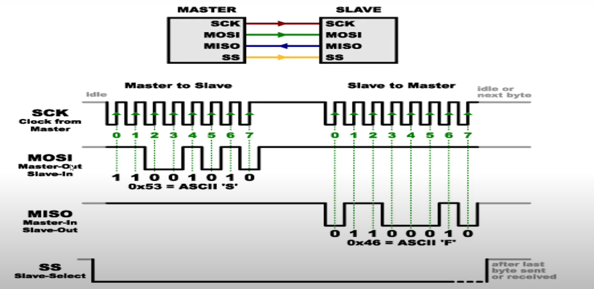

# FUNCTION IN RAM - STM32 Microcontrollers

## Tổng quan (Overview)

**Function in RAM** là một kỹ thuật quan trọng trong lập trình vi điều khiển STM32, cho phép thực thi các hàm từ bộ nhớ RAM thay vì Flash memory. Điều này đặc biệt quan trọng khi thực hiện các thao tác với Flash memory như ghi, xóa, hoặc cấu hình Flash interface.

## Tại sao cần Function in RAM? (Why Function in RAM?)

### 1. **Vấn đề với Flash Memory**
- Khi CPU đang thực thi code từ Flash memory, không thể đồng thời thực hiện các thao tác ghi/xóa Flash
- Việc cố gắng ghi Flash trong khi đang thực thi từ Flash sẽ gây ra lỗi hoặc crash hệ thống

### 2. **Giải pháp**
- Di chuyển các hàm cần thiết vào RAM
- Thực thi các hàm này từ RAM trong khi thao tác với Flash
- Đảm bảo tính ổn định và an toàn của hệ thống

### Biến toàn cục
- Biến toàn cục có khởi tạo giá trị ban đầu sẽ được lưu trong flash, khi chạy nó sẽ tạo vùng nhớ trên ram và đưa giá trị lên ram để. Tận dụng điều này để chạy funtion trên ram.
- Bình thường hàm được lưu ở vùng nhớ text hoặc là code sigment. Mình sẽ đưa nó lên vùng nhó có khởi tạo giá trị ban đầu vùng nhớ data 

### Lưu ý
- trong HAL_Init() có systick nó sẽ 1ms chạy 1 lần, khi có interrupt nhảy đến Systick_Handler để thực hiện. Trong systick handler có HAL_IncTick để chạy 

- Nhưng khi erase thì nó sẽ erase hết khi có sự kiện ngắt xảy ra nó nhảy đến vectortable lock thì nó nhảy tùm bậy làm cho chương trình bị treo.
- Khi erase flash disable systemtick đi.
- Khi xóa rồi thì chỉ chạy được hàm trên ram thôi còn dưới flash thì không được.

## Cách triển khai (Implementation)

### 1. **Định nghĩa Macro `__RAM_FUNC`**

```c
// Trong file stm32f4xx_hal_def.h
#if defined ( __CC_ARM   ) || (defined (__ARMCC_VERSION) && (__ARMCC_VERSION >= 6010050))
/* ARM Compiler V4/V5 and V6 */
#define __RAM_FUNC

#elif defined ( __ICCARM__ )
/* ICCARM Compiler */
#define __RAM_FUNC __ramfunc

#elif defined   (  __GNUC__  )
/* GNU Compiler */
#define __RAM_FUNC __attribute__((section(".RamFunc")))

#endif
```

### 2. **Các Compiler khác nhau**

#### **ARM Compiler (Keil)**
```c
// Sử dụng toolchain options
// Functions được đặt trong separate source module
// Sử dụng 'Options for File' dialog để thay đổi 'Code / Const' area
```

#### **IAR Compiler**
```c
__ramfunc void my_flash_function(void)
{
    // Function code here
}
```

#### **GNU Compiler (GCC)**
```c
__attribute__((section(".RamFunc"))) void my_flash_function(void)
{
    // Function code here
}
```

## Các hàm RAM Function trong STM32F4

### 1. **Flash Interface Control Functions**

```c
// Dừng Flash interface trong khi System Run
__RAM_FUNC HAL_StatusTypeDef HAL_FLASHEx_StopFlashInterfaceClk(void);

// Khởi động Flash interface trong khi System Run  
__RAM_FUNC HAL_StatusTypeDef HAL_FLASHEx_StartFlashInterfaceClk(void);

// Bật Flash sleep mode trong khi System Run
__RAM_FUNC HAL_StatusTypeDef HAL_FLASHEx_EnableFlashSleepMode(void);

// Tắt Flash sleep mode trong khi System Run
__RAM_FUNC HAL_StatusTypeDef HAL_FLASHEx_DisableFlashSleepMode(void);
```

### 2. **Ví dụ sử dụng**

```c
#include "stm32f4xx_hal.h"

void flash_operation_example(void)
{
    // Dừng Flash interface
    HAL_FLASHEx_StopFlashInterfaceClk();
    
    // Thực hiện các thao tác với Flash
    // Ví dụ: ghi, xóa Flash
    
    // Khởi động lại Flash interface
    HAL_FLASHEx_StartFlashInterfaceClk();
}
```

## Các thiết bị hỗ trợ (Supported Devices)

Các hàm RAM function được hỗ trợ trên các thiết bị STM32F4 sau:
- STM32F410Tx, STM32F410Cx, STM32F410Rx
- STM32F411xE
- STM32F446xx
- STM32F412Zx, STM32F412Vx, STM32F412Rx, STM32F412Cx

## Linker Script Configuration

### 1. **Định nghĩa Section .RamFunc**

```ld
/* Trong linker script (.ld file) */
SECTIONS
{
    .ramfunc :
    {
        . = ALIGN(4);
        *(.ramfunc)
        . = ALIGN(4);
    } >RAM AT> FLASH
}
```

### 2. **Copy Section từ Flash sang RAM**

```c
// Trong startup code
extern uint32_t _sramfunc, _eramfunc, _sidata;

// Copy RAM functions từ Flash sang RAM
uint32_t *pSrc = &_sidata;
uint32_t *pDest = &_sramfunc;

while (pDest < &_eramfunc)
{
    *pDest++ = *pSrc++;
}
```

## Best Practices

### 1. **Tối ưu hóa kích thước**
- Chỉ đặt các hàm thực sự cần thiết vào RAM
- RAM có kích thước hạn chế so với Flash

### 2. **Performance**
- Các hàm trong RAM thực thi nhanh hơn Flash
- Tuy nhiên, tốn thêm thời gian copy từ Flash sang RAM

### 3. **Debugging**
- Các hàm RAM function có thể khó debug hơn
- Sử dụng breakpoints cẩn thận

## Ví dụ thực tế (Practical Example)

### **Flash Programming với RAM Function**

```c
#include "stm32f4xx_hal.h"

// RAM function để ghi Flash
__RAM_FUNC HAL_StatusTypeDef Flash_Program(uint32_t Address, uint32_t Data)
{
    FLASH_EraseInitTypeDef EraseInitStruct;
    uint32_t PAGEError = 0;
    
    // Cấu hình erase
    EraseInitStruct.TypeErase = FLASH_TYPEERASE_PAGES;
    EraseInitStruct.PageAddress = Address;
    EraseInitStruct.NbPages = 1;
    
    // Xóa page
    if (HAL_FLASHEx_Erase(&EraseInitStruct, &PAGEError) != HAL_OK)
    {
        return HAL_ERROR;
    }
    
    // Ghi dữ liệu
    if (HAL_FLASH_Program(FLASH_TYPEPROGRAM_WORD, Address, Data) != HAL_OK)
    {
        return HAL_ERROR;
    }
    
    return HAL_OK;
}

// Sử dụng trong main
int main(void)
{
    // Khởi tạo HAL
    HAL_Init();
    
    // Ghi Flash sử dụng RAM function
    uint32_t address = 0x08008000;
    uint32_t data = 0x12345678;
    
    if (Flash_Program(address, data) == HAL_OK)
    {
        // Success
    }
    
    while(1)
    {
        // Main loop
    }
}
```

## Troubleshooting

### 1. **Lỗi thường gặp**
- **Linker Error**: Section .RamFunc không được định nghĩa
- **Runtime Error**: Hàm không được copy từ Flash sang RAM
- **Memory Error**: RAM không đủ để chứa các hàm

### 2. **Debugging Tips**
- Kiểm tra linker script
- Verify RAM function được copy đúng cách
- Sử dụng debugger để kiểm tra địa chỉ thực thi

## Kết luận (Conclusion)

Function in RAM là một kỹ thuật quan trọng trong lập trình STM32, đặc biệt khi làm việc với Flash memory. Việc hiểu và triển khai đúng cách sẽ giúp tạo ra các ứng dụng ổn định và an toàn.

---

## Tài liệu tham khảo (References)
- STM32F4xx HAL Driver Documentation
- STM32F4xx Reference Manual
- ARM Cortex-M4 Technical Reference Manual

## Link tham khảo
- https://developer.arm.com/documentation/dui0474/g/using-scatter-files/using---attribute----section--name-----to-place-code-and-data

