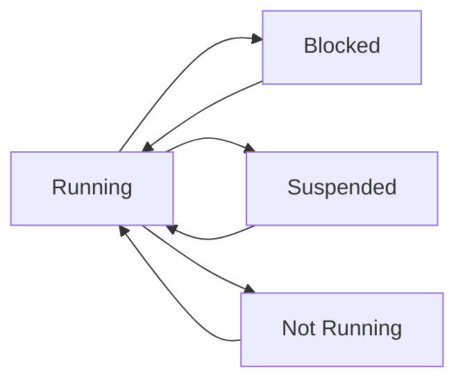

# 🎓 STM32F411 Learning Guide

## 📚 Nội dung
1. [FreeRTOS](#freertos)

## FreeRTOS

### 📚 Giới thiệu
FreeRTOS là hệ điều hành thời gian thực (RTOS) mã nguồn mở, được thiết kế cho các hệ thống nhúng. Nó cung cấp:
- ⚡ Lập lịch task theo thời gian thực
- 🔄 Đồng bộ hóa và giao tiếp giữa các task
- 💾 Quản lý bộ nhớ động
- ⏰ Quản lý thời gian chính xác

### 🎯 Task Management

#### 1. Task States

```mermaid
graph LR
    R[Running] --> B[Blocked]
    B --> R
    R --> S[Suspended]
    S --> R
    N[Not Running] --> R
    R --> N
```

- **Running**: Task đang được thực thi
- **Ready**: Task sẵn sàng chạy
- **Blocked**: Task đang chờ event/delay
- **Suspended**: Task bị tạm dừng

#### 2. API Cơ bản
```c
// Tạo task
xTaskCreate(
    vTaskCode,        // Task function
    "TaskName",       // Task name
    1000,            // Stack size (words)
    NULL,            // Parameters
    1,               // Priority
    &taskHandle      // Task handle
);

// Xóa task
vTaskDelete(taskHandle);

// Tạm dừng task
vTaskSuspend(taskHandle);

// Tiếp tục task
vTaskResume(taskHandle);
```

### 🔄 Task Synchronization

#### 1. Semaphore
```c
// Binary semaphore
xSemaphore = xSemaphoreCreateBinary();

// Counting semaphore
xSemaphore = xSemaphoreCreateCounting(5, 0);

// Give & Take
xSemaphoreGive(xSemaphore);
xSemaphoreTake(xSemaphore, portMAX_DELAY);
```

#### 2. Mutex
```c
// Create mutex
xMutex = xSemaphoreCreateMutex();

// Sử dụng mutex
if(xSemaphoreTake(xMutex, portMAX_DELAY)) {
    // Critical section
    xSemaphoreGive(xMutex);
}
```

#### 3. Queue
```c
// Create queue
QueueHandle_t xQueue = xQueueCreate(5, sizeof(uint32_t));

// Send & Receive
xQueueSend(xQueue, &data, portMAX_DELAY);
xQueueReceive(xQueue, &data, portMAX_DELAY);
```

### ⏰ Timing Control

#### 1. Task Delay
```c
// Delay tương đối
vTaskDelay(pdMS_TO_TICKS(1000));

// Delay chính xác
TickType_t xLastWakeTime = xTaskGetTickCount();
vTaskDelayUntil(&xLastWakeTime, pdMS_TO_TICKS(1000));
```

#### 2. Software Timer
```c
TimerHandle_t xTimer = xTimerCreate(
    "Timer",                   // Tên
    pdMS_TO_TICKS(1000),      // Period
    pdTRUE,                   // Auto reload
    0,                        // ID
    vTimerCallback            // Callback
);
xTimerStart(xTimer, 0);
```

### 🛠️ Ví dụ thực tế

#### 1. LED Blink với RTOS
```c
void vLedTask(void* params) {
    while(1) {
        HAL_GPIO_TogglePin(LED_GPIO_Port, LED_Pin);
        vTaskDelay(pdMS_TO_TICKS(1000));
    }
}

void vButtonTask(void* params) {
    while(1) {
        if(HAL_GPIO_ReadPin(BTN_GPIO_Port, BTN_Pin)) {
            xSemaphoreGive(xButtonSemaphore);
        }
        vTaskDelay(pdMS_TO_TICKS(10));
    }
}
```

#### 2. UART Communication
```c
void vUartRxTask(void* params) {
    uint8_t data;
    while(1) {
        if(HAL_UART_Receive(&huart1, &data, 1, portMAX_DELAY) == HAL_OK) {
            xQueueSend(xUartQueue, &data, portMAX_DELAY);
        }
    }
}

void vUartTxTask(void* params) {
    uint8_t data;
    while(1) {
        if(xQueueReceive(xUartQueue, &data, portMAX_DELAY)) {
            HAL_UART_Transmit(&huart1, &data, 1, HAL_MAX_DELAY);
        }
    }
}
```

### ⚠️ Lưu ý quan trọng

#### 1. Priority Inversion
- Sử dụng mutex thay vì semaphore cho shared resources
- Cân nhắc sử dụng priority inheritance
- Tránh blocking trong ISR

#### 2. Stack & Memory
- Kiểm tra stack size đủ lớn
- Sử dụng static allocation khi có thể
- Tránh malloc trong task

#### 3. Timing
- Sử dụng vTaskDelayUntil cho periodic tasks
- Tránh busy waiting
- Xem xét jitter trong real-time tasks

### 🔍 Debug Tips
```c
// Task stats
void vTaskStats(void) {
    char* pcBuffer = pvPortMalloc(1024);
    vTaskList(pcBuffer);
    printf("Task List:\n%s\n", pcBuffer);
    vPortFree(pcBuffer);
}

// Runtime stats
void vRuntimeStats(void) {
    char* pcBuffer = pvPortMalloc(1024);
    vTaskGetRunTimeStats(pcBuffer);
    printf("Runtime Stats:\n%s\n", pcBuffer);
    vPortFree(pcBuffer);
}
```

### 📝 Best Practices
1. **Task Priority**
   - ISR callbacks: Highest
   - Communication tasks: High
   - Application tasks: Normal
   - Background tasks: Low
   - Idle task: Lowest

2. **Resource Management**
   - Sử dụng static allocation
   - Tránh recursive mutex
   - Kiểm soát thời gian trong critical section

3. **Error Handling**
   - Xử lý timeout
   - Kiểm tra return values
   - Implement watchdog
