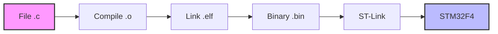

# 🎯 STM32 Register Programming Project

<div align="center">
  

  
  
  
</div>

## 📝 Quy trình Biên dịch và Nạp chương trình


```mermaid
graph LR
    A[File .c] --> B[Compile .o]
    B --> C[Link .elf]
    C --> D[Binary .bin]
    D --> E[ST-Link]
    E --> F[STM32F4]
    style A fill:#f9f,stroke:#333,stroke-width:2px
    style F fill:#bbf,stroke:#333,stroke-width:2px
```

### 🔍 Chi tiết các bước:

| Bước | File | Mô tả |
|------|------|--------|
| 1️⃣ | **File .c** | • File mã nguồn viết bằng C<br>• Chứa code điều khiển thanh ghi<br>• Dễ đọc, dễ bảo trì |
| 2️⃣ | **File .o** | • Biên dịch file .c thành mã máy dạng object<br>• Mã máy này chưa hoàn chỉnh<br>• Còn chứa thông tin debug và bảng ký hiệu |
| 3️⃣ | **File .elf** | • Liên kết các file .o thành một file thực thi<br>• Gán địa chỉ cụ thể cho code và data<br>• Sắp xếp các section (.text, .data, .bss) |
| 4️⃣ | **File .bin** | • Chuyển từ .elf sang định dạng nhị phân thuần túy<br>• Chỉ chứa mã máy và dữ liệu<br>• Sẵn sàng để nạp vào Flash |

### 💻 Lệnh biên dịch cơ bản:

<details>
<summary>📚 Xem help và các tham số của arm-none-eabi-gcc</summary>

```bash
# Xem help và các tham số
arm-none-eabi-gcc --help
arm-none-eabi-gcc --target-help    # Xem các tùy chọn cho ARM
```

#### Các tham số quan trọng:
| Tham số | Mô tả |
|---------|--------|
| `-c` | Chỉ biên dịch không liên kết |
| `-g` | Tạo thông tin debug |
| `-O0` → `-O3` | Các mức tối ưu hóa |
| `-mcpu=<cpu>` | Chọn kiến trúc CPU |
| `-mthumb` | Dùng bộ lệnh Thumb |
| `-x` | Chỉ định loại ngôn ngữ đầu vào |
| `-I<dir>` | Thêm thư mục chứa header |
| `-D<macro>` | Định nghĩa macro |
| `-Wall` | Hiện tất cả cảnh báo |
</details>

<details>
<summary>🛠️ Các lệnh biên dịch cơ bản</summary>

```bash
# Kiểm tra version gcc 
arm-none-eabi-gcc --version

# Biên dịch file startup assembly (.s)
arm-none-eabi-gcc -x assembler-with-cpp -c startup_stm32f411vetx.s -mcpu=cortex-m4 -std=gnu11 -o build/startup.o

# Biên dịch file .c thành .o
arm-none-eabi-gcc -c main.c -mcpu=cortex-m4 -mthumb -std=gnu11 -IDriver/Inc -o build/main.o

# Liên kết thành file .elf
arm-none-eabi-gcc main.o startup.o -mcpu=cortex-m4 -mthumb -T STM32F411VETX_FLASH.ld -o program.elf

# Tạo file binary
arm-none-eabi-objcopy -O binary program.elf program.bin

# Nạp chương trình (sử dụng ST-Link)
st-flash write program.bin 0x08000000
```
</details>

### 📝 Giải thích lệnh biên dịch file Startup:
```bash
arm-none-eabi-gcc -x assembler-with-cpp -c startup_stm32f411vetx.s -mcpu=cortex-m4 -std=gnu11 -o build/startup.o
```
- `-x assembler-with-cpp`: Chỉ định đây là file assembly có thể chứa preprocessor directives
- `-c`: Chỉ biên dịch, không liên kết
- `startup_stm32f411vetx.s`: File startup assembly chứa vector table và khởi tạo hệ thống
- `-mcpu=cortex-m4`: Chỉ định CPU đích
- `-std=gnu11`: Chuẩn GNU11
- `-o build/startup.o`: File đầu ra

### 📁 Cấu trúc thư mục cho biên dịch:
```
Project/
├── 📂 Driver/
│   └── 📂 Inc/         # Thư mục chứa file header (.h)
├── 📂 Core/
│   ├── 📂 Inc/         # Header files
│   └── 📂 Src/         # Source files (.c)
└── 📂 build/           # Thư mục chứa file sau biên dịch
    ├── 📄 main.o
    ├── 📄 program.elf
    └── 📄 program.bin
```

### ℹ️ Note
- Gcc là trình biên dịch cho máy tính (x86/x64)
- arm-none-eabi-gcc là trình biên dịch cho vi điều khiển ARM
- Cần thêm các tham số phù hợp với kiến trúc ARM Cortex-M4
- Đường dẫn trong `-I` phải trỏ đến thư mục chứa file .h
- Nên tạo thư mục build để chứa các file biên dịch

---
<div align="center">
  <i>Made with ❤️ for STM32 Development</i>
</div>