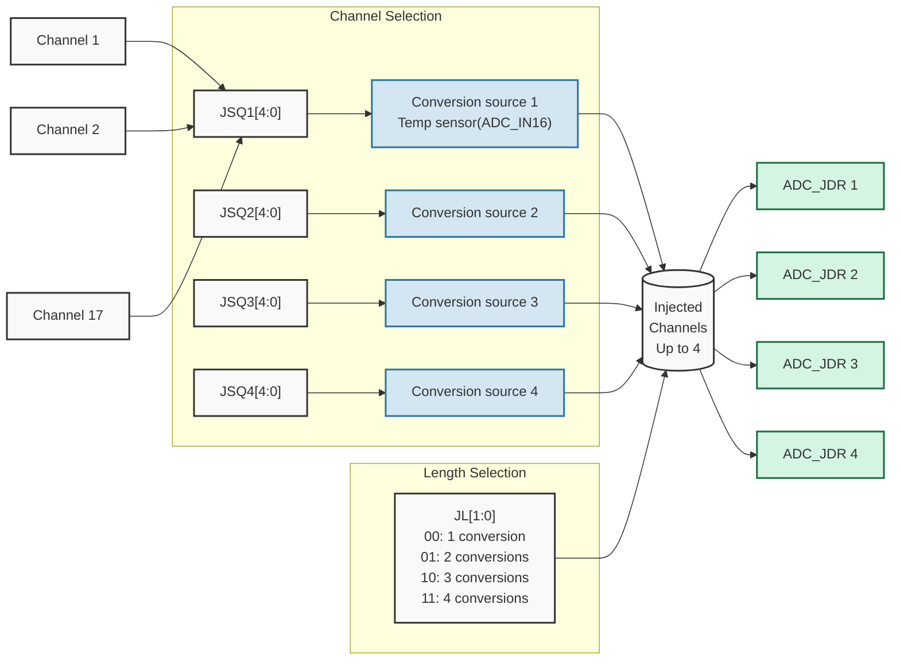

# Learning ADC on STM32F411 Using Register Programming

## Overview
STM32F411 có ADC 12-bit với tối đa 16 kênh. Repository này hướng dẫn cách lập trình ADC bằng cách thao tác trực tiếp với thanh ghi.

## ADC Introduction
- ADC (Analog to Digital Converter) là bộ chuyển đổi tín hiệu từ analog sang digital
- Trong STM32F411 được tích hợp 2 bộ ADC 12 bit (12 bit tương ứng với giá trị tối đa mà ADC đo được là 2^12 - 1 = 4095)
- ADC trong STM32F411 dùng để đo hiệu điện thế
- Công thức tính điện áp đầu vào:
```
Vin = (Data register × Vref) / 4095
```
Trong đó:
- Vin: Điện áp đầu vào cần đo
- Data register: Giá trị đọc được từ ADC
- Vref: Điện áp tham chiếu (thường là 3.3V hoặc 5V)
- 4095: Giá trị tối đa của ADC 12-bit (2^12 - 1)

## Cấu trúc kênh ADC (Injected Channels)

### Sơ đồ cấu trúc

```mermaid
graph LR
    %% Input Channels
    CH1[Channel 1] --> JSQ1
    CH2[Channel 2] --> JSQ1
    CH17[Channel 17] --> JSQ1
    
    %% JSQ Multiplexers
    subgraph "Channel Selection"
        JSQ1["JSQ1[4:0]"] --> CS1["Conversion source 1<br/>Temp sensor(ADC_IN16)"]
        JSQ2["JSQ2[4:0]"] --> CS2["Conversion source 2"]
        JSQ3["JSQ3[4:0]"] --> CS3["Conversion source 3"]
        JSQ4["JSQ4[4:0]"] --> CS4["Conversion source 4"]
    end
    
    %% JL Selection
    subgraph "Length Selection"
        JL["JL[1:0]<br/>00: 1 conversion<br/>01: 2 conversions<br/>10: 3 conversions<br/>11: 4 conversions"]
    end
    
    %% Conversion Process
    CS1 --> IC[("Injected<br/>Channels<br/>Up to 4")]
    CS2 --> IC
    CS3 --> IC
    CS4 --> IC
    
    JL --> IC
    
    %% Results
    IC --> JDR1["ADC_JDR 1"]
    IC --> JDR2["ADC_JDR 2"]
    IC --> JDR3["ADC_JDR 3"]
    IC --> JDR4["ADC_JDR 4"]

    %% Styling
    classDef default fill:#f9f9f9,stroke:#333,stroke-width:2px;
    classDef conversion fill:#d4e6f1,stroke:#2874a6,stroke-width:2px;
    classDef result fill:#d5f5e3,stroke:#196f3d,stroke-width:2px;
    
    class CS1,CS2,CS3,CS4 conversion;
    class JDR1,JDR2,JDR3,JDR4 result;
```

### Giải thích sơ đồ
1. **Đầu vào (Input Channels)**
   - Có thể chọn từ Channel 1 đến Channel 17
   - Channel 16 thường được dùng cho cảm biến nhiệt độ

2. **Bộ chọn kênh (Channel Selection)**
   - Mỗi JSQx[4:0] chọn một kênh đầu vào
   - Có thể cấu hình tối đa 4 nguồn chuyển đổi

3. **Chọn độ dài (Length Selection)**
   - JL[1:0] xác định số lượng chuyển đổi
   - Có thể chọn từ 1 đến 4 chuyển đổi

4. **Kết quả (Results)**
   - Mỗi kết quả chuyển đổi được lưu vào một thanh ghi ADC_JDR riêng
   - Các thanh ghi được cập nhật theo thứ tự chuyển đổi

### Cấu trúc chuyển đổi
1. **Bộ chọn kênh (JSQx[4:0])**
   - JSQ1[4:0]: Chọn kênh cho nguồn chuyển đổi 1
   - JSQ2[4:0]: Chọn kênh cho nguồn chuyển đổi 2
   - JSQ3[4:0]: Chọn kênh cho nguồn chuyển đổi 3
   - JSQ4[4:0]: Chọn kênh cho nguồn chuyển đổi 4

2. **Số lượng chuyển đổi (JL[1:0])**
   - 00: 1 lần chuyển đổi
   - 01: 2 lần chuyển đổi
   - 10: 3 lần chuyển đổi
   - 11: 4 lần chuyển đổi

3. **Thanh ghi dữ liệu (ADC_JDRx)**
   - ADC_JDR1: Lưu kết quả chuyển đổi 1
   - ADC_JDR2: Lưu kết quả chuyển đổi 2
   - ADC_JDR3: Lưu kết quả chuyển đổi 3
   - ADC_JDR4: Lưu kết quả chuyển đổi 4

### Thứ tự chuyển đổi
Dựa vào giá trị JL (Injected Length), ADC sẽ thực hiện chuyển đổi theo thứ tự:
- JL = 00: Chỉ chuyển đổi JSQ1
- JL = 01: JSQ1 >> JSQ2
- JL = 10: JSQ1 >> JSQ2 >> JSQ3
- JL = 11: JSQ1 >> JSQ2 >> JSQ3 >> JSQ4


## Hardware Features
- Độ phân giải 12-bit
- 16 kênh ngoài
- Phạm vi chuyển đổi: 0 đến 3.3V
- Thời gian lấy mẫu có thể lập trình
- Chế độ đơn, liên tục, quét hoặc không liên tục
- Hỗ trợ DMA

## So sánh Analog và Digital
### Analog
- Tín hiệu liên tục theo thời gian
- Dễ bị nhiễu và suy giảm theo khoảng cách
- Ví dụ: khi truyền 10V qua đường dây dài, do trở kháng có thể chỉ còn 8V
- Thường dùng trong các cảm biến đo lường (nhiệt độ, áp suất, gia tốc...)

### Digital
- Tín hiệu rời rạc, biểu diễn bằng các bit 0 và 1
- Truyền tín hiệu xa hơn, ít bị nhiễu hơn
- Sử dụng mức điện áp chuẩn TTL:
  + Logic 0 (LOW): 0V - 0.8V
  + Logic 1 (HIGH): 2.4V - Vcc
- Dễ dàng xử lý và lưu trữ bằng vi xử lý

## Key Registers
1. **ADC_CR1** (Thanh ghi điều khiển 1)
   - Chế độ SCAN
   - Cấu hình độ phân giải
   - Chế độ không liên tục
   - Các bit cho phép ngắt

2. **ADC_CR2** (Thanh ghi điều khiển 2)
   - Bật/Tắt ADC
   - Chuyển đổi liên tục
   - Cho phép DMA
   - Lựa chọn kích hoạt ngoài
   - Căn chỉnh dữ liệu

3. **ADC_SQRx** (Thanh ghi chuỗi thông thường)
   - Lựa chọn thứ tự kênh
   - Độ dài chuỗi

4. **ADC_SMPRx** (Thanh ghi thời gian lấy mẫu)
   - Lựa chọn thời gian lấy mẫu cho kênh

5. **ADC_DR** (Thanh ghi dữ liệu)
   - Kết quả chuyển đổi

## Basic Steps
1. Bật clock cho ADC
```c
RCC->APB2ENR |= RCC_APB2ENR_ADC1EN;
```

2. Cấu hình GPIO là analog
```c
// Ví dụ cho PA0 (Kênh ADC 0)
RCC->AHB1ENR |= RCC_AHB1ENR_GPIOAEN;
GPIOA->MODER |= GPIO_MODER_MODER0;  // Đặt là chế độ analog
```

3. Cấu hình ADC
```c
// Ví dụ cấu hình cơ bản
ADC1->CR2 |= ADC_CR2_ADON;  // Bật ADC
ADC1->SQR3 = 0;  // Chọn kênh 0
ADC1->SQR1 = 0;  // 1 lần chuyển đổi
ADC1->CR2 |= ADC_CR2_CONT;  // Chế độ liên tục
```

## Operation Modes
1. **Single Conversion**
   - Một lần chuyển đổi khi được kích hoạt
   - Thích hợp cho đọc giá trị không thường xuyên

2. **Continuous Conversion**
   - Chuyển đổi liên tục sau khi kích hoạt
   - Phù hợp cho việc theo dõi liên tục

3. **Scan Mode**
   - Chuyển đổi nhiều kênh theo trình tự
   - Hữu ích khi cần đọc nhiều cảm biến

4. **Discontinuous Mode**
   - Chuyển đổi một tập con các kênh
   - Cho phép kiểm soát linh hoạt việc lấy mẫu

## Ưu điểm
- truyền nhanh hơn nhưng tính hiện digital truyền được xa hơn.
- Vì đường dây điện có trở kháng nên khi truyền đi 10v thì còn 8. v
- Còn digital thì truyền theo mức điện điện chuẩn TTL (0-0.8) low và (2.4 - Vcc) high.

## References
1. STM32F411 Reference Manual (RM0383) - Tài liệu tham khảo chính
2. STM32F411 Datasheet - Thông số kỹ thuật
3. Programming Manual (PM0214) - Hướng dẫn lập trình

## Notes
- Đảm bảo nguồn cấp phù hợp (2.4V - 3.6V)
- Cân nhắc thời gian lấy mẫu dựa trên trở kháng đầu vào
- Sử dụng DMA cho chuyển đổi liên tục tốc độ cao
- Kiểm tra chính xác việc căn chỉnh dữ liệu (left/right alignment)
- Tính toán thời gian lấy mẫu phù hợp với ứng dụng
- Đảm bảo điện áp đầu vào không vượt quá Vref
- Cân nhắc sử dụng bộ lọc nhiễu cho tín hiệu analog đầu vào
