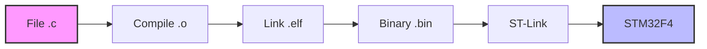

# 🎯 STM32 Register Programming Project

<div align="center">
  

  
  
  
</div>

## 📝 Quy trình Biên dịch và Nạp chương trình


```mermaid
graph LR
    A[File .c] --> B[Compile .o]
    B --> C[Link .elf]
    C --> D[Binary .bin]
    D --> E[ST-Link]
    E --> F[STM32F4]
    style A fill:#f9f,stroke:#333,stroke-width:2px
    style F fill:#bbf,stroke:#333,stroke-width:2px
```

### 🔍 Chi tiết các bước:

| Bước | File | Mô tả |
|------|------|--------|
| 1️⃣ | **File .c** | • File mã nguồn viết bằng C<br>• Chứa code điều khiển thanh ghi<br>• Dễ đọc, dễ bảo trì |
| 2️⃣ | **File .o** | • Biên dịch file .c thành mã máy dạng object<br>• Mã máy này chưa hoàn chỉnh<br>• Còn chứa thông tin debug và bảng ký hiệu |
| 3️⃣ | **File .elf** | • Liên kết các file .o thành một file thực thi<br>• Gán địa chỉ cụ thể cho code và data<br>• Sắp xếp các section (.text, .data, .bss) |
| 4️⃣ | **File .bin** | • Chuyển từ .elf sang định dạng nhị phân thuần túy<br>• Chỉ chứa mã máy và dữ liệu<br>• Sẵn sàng để nạp vào Flash |

### 💻 Lệnh biên dịch cơ bản:

<details>
<summary>📚 Xem help và các tham số của arm-none-eabi-gcc</summary>

```bash
# Xem help và các tham số
arm-none-eabi-gcc --help
arm-none-eabi-gcc --target-help    # Xem các tùy chọn cho ARM
```

#### Các tham số quan trọng:
| Tham số | Mô tả |
|---------|--------|
| `-c` | Chỉ biên dịch không liên kết |
| `-g` | Tạo thông tin debug |
| `-O0` → `-O3` | Các mức tối ưu hóa |
| `-mcpu=<cpu>` | Chọn kiến trúc CPU |
| `-mthumb` | Dùng bộ lệnh Thumb |
| `-x` | Chỉ định loại ngôn ngữ đầu vào |
| `-I<dir>` | Thêm thư mục chứa header |
| `-D<macro>` | Định nghĩa macro |
| `-Wall` | Hiện tất cả cảnh báo |
</details>

<details>
<summary>🛠️ Các lệnh biên dịch cơ bản</summary>

```bash
# Kiểm tra version gcc 
arm-none-eabi-gcc --version

# Biên dịch file startup assembly (.s)
arm-none-eabi-gcc -x assembler-with-cpp -c startup_stm32f411vetx.s -mcpu=cortex-m4 -std=gnu11 -o build/startup.o

# Biên dịch file .c thành .o
arm-none-eabi-gcc -c main.c -mcpu=cortex-m4 -mthumb -std=gnu11 -IDriver/Inc -o build/main.o

# Liên kết thành file .elf
arm-none-eabi-gcc main.o startup.o -mcpu=cortex-m4 -mthumb -T STM32F411VETX_FLASH.ld -o program.elf

# Tạo file binary
arm-none-eabi-objcopy -O binary program.elf program.bin

# Nạp chương trình (sử dụng ST-Link)
st-flash write program.bin 0x08000000
```
</details>

### 📝 Giải thích lệnh biên dịch file Startup:
```bash
arm-none-eabi-gcc -x assembler-with-cpp -c startup_stm32f411vetx.s -mcpu=cortex-m4 -std=gnu11 -o build/startup.o
```
#### 🔍 Chi tiết từng phần:
1. `arm-none-eabi-gcc`: 
   - Trình biên dịch cho vi xử lý ARM
   - `none-eabi`: biên dịch cho hệ thống nhúng (không có hệ điều hành)

2. `-x assembler-with-cpp`: 
   - Chỉ định đây là file assembly
   - Cho phép sử dụng preprocessor của C trong file assembly
   - Có thể dùng #include, #define trong file .s

3. `-c`: 
   - Chỉ biên dịch thành file object (.o)
   - Không thực hiện liên kết (linking)

4. `startup_stm32f411vetx.s`:
   - File assembly chứa mã khởi động cho STM32F411
   - Chứa vector bảng ngắt (Interrupt Vector Table)
   - Mã khởi tạo stack và reset handler
   - Các handler ngắt mặc định

5. `-mcpu=cortex-m4`:
   - Chỉ định loại CPU là Cortex-M4
   - Tối ưu mã cho kiến trúc Cortex-M4

6. `-std=gnu11`:
   - Sử dụng chuẩn GNU C11
   - Áp dụng cho phần preprocessor C

7. `-o build/startup.o`:
   - File đầu ra là startup.o
   - Được lưu trong thư mục build

#### 🎯 Mục đích của file startup:
- Thiết lập môi trường ban đầu cho vi điều khiển
- Xử lý quá trình reset
- Cấu hình bảng vector ngắt
- Chuyển điều khiển đến hàm main của chương trình

### 📁 Cấu trúc thư mục cho biên dịch:
```
Project/
├── 📂 Driver/
│   └── 📂 Inc/         # Thư mục chứa file header (.h)
├── 📂 Core/
│   ├── 📂 Inc/         # Header files
│   └── 📂 Src/         # Source files (.c)
└── 📂 build/           # Thư mục chứa file sau biên dịch
    ├── 📄 main.o
    ├── 📄 program.elf
    └── 📄 program.bin
```

### ℹ️ Note
- Gcc là trình biên dịch cho máy tính (x86/x64)
- arm-none-eabi-gcc là trình biên dịch cho vi điều khiển ARM
- Cần thêm các tham số phù hợp với kiến trúc ARM Cortex-M4
- Đường dẫn trong `-I` phải trỏ đến thư mục chứa file .h
- Nên tạo thư mục build để chứa các file biên dịch

### 📝 Chi tiết lệnh trong Makefile:

#### 1. Biên dịch các file nguồn:
```bash
# Biên dịch file main.c
arm-none-eabi-gcc -c main.c -mcpu=cortex-m4 -std=gnu11 -IDriver\Inc -o build/main.o

# Biên dịch các file trong thư mục Driver/Src
arm-none-eabi-gcc -c Driver\Src\Led.c -mcpu=cortex-m4 -std=gnu11 -IDriver\Inc -o build/led.o
arm-none-eabi-gcc -c Driver\Src\ADC.c -mcpu=cortex-m4 -std=gnu11 -IDriver\Inc -o build/ADC.o
arm-none-eabi-gcc -c Driver\Src\clock.c -mcpu=cortex-m4 -std=gnu11 -IDriver\Inc -o build/clock.o
arm-none-eabi-gcc -c Driver\Src\delay.c -mcpu=cortex-m4 -std=gnu11 -IDriver\Inc -o build/delay.o
arm-none-eabi-gcc -c Driver\Src\capture.c -mcpu=cortex-m4 -std=gnu11 -IDriver\Inc -o build/capture.o
arm-none-eabi-gcc -c Driver\Src\Usart.c -mcpu=cortex-m4 -std=gnu11 -IDriver\Inc -o build/Usart.o
```

Trong đó:
- `-c`: Chỉ biên dịch, không liên kết
- `-mcpu=cortex-m4`: Chỉ định CPU đích
- `-std=gnu11`: Sử dụng chuẩn GNU C11
- `-IDriver\Inc`: Thêm thư mục chứa file header
- `-o build/xxx.o`: File đầu ra

#### 2. Liên kết các file object:
```bash
arm-none-eabi-gcc build\ADC.o build\capture.o build\clock.o build\Delay.o build\Led.o build\main.o build\startup.o -T"STM32F411VETX_FLASH.ld" -Wl,-Map="file.map" -Wl,--gc-sections -static -o build/blink_led.elf
```

Trong đó:
- `build\*.o`: Các file object cần liên kết
- `-T"STM32F411VETX_FLASH.ld"`: Script mô tả bố trí bộ nhớ
- `-Wl,-Map="file.map"`: Tạo file map để debug
- `-Wl,--gc-sections`: Loại bỏ code không sử dụng
- `-static`: Liên kết tĩnh
- `-o build/blink_led.elf`: File thực thi đầu ra

#### 3. Tạo file hex và binary:
```bash
# Tạo file hex để nạp và debug
arm-none-eabi-objcopy -O ihex build/blink_led.elf build/blink_led.hex

# Tạo file binary để nạp vào flash
arm-none-eabi-objcopy -O binary build/blink_led.elf build/blink_led.bin
```

#### 4. Dọn dẹp và tạo mới:
```bash
# Xóa thư mục build
rmdir /q /s build

# Tạo lại thư mục build
mkdir build
```

### 🔄 Quy trình sử dụng:
1. `mingw32-make Clean`: Xóa các file đã biên dịch
2. `mingw32-make All`: Biên dịch toàn bộ project
3. Các file output trong thư mục `build`:
   - `*.o`: File object
   - `*.elf`: File thực thi
   - `*.hex`: File hex để nạp/debug
   - `*.bin`: File binary để nạp
   - `*.map`: File map để debug

---
<div align="center">
  <i>Made with ❤️ for STM32 Development</i>
</div>