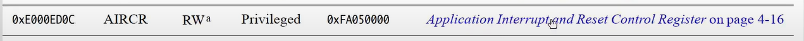

# 🔧 STM32F411 I2C Programming with Registers

## 📋 Mục Lục
- [📝 Tổng Quan](#-tổng-quan)
- [🛠️ Yêu Cầu Phần Cứng](#️-yêu-cầu-phần-cứng)
- [📡 Lý Thuyết I2C](#-lý-thuyết-i2c)
- [💻 Lập Trình](#-lập-trình)
- [🔍 Xử Lý Lỗi](#-xử-lý-lỗi)
- [📚 Tài Liệu Tham Khảo](#-tài-liệu-tham-khảo)

## 📝 Tổng Quan
Tài liệu này hướng dẫn lập trình giao tiếp I2C trên vi điều khiển STM32F411 sử dụng thanh ghi (không sử dụng thư viện HAL).

## 🛠️ Yêu Cầu Phần Cứng
### 📌 Thiết Bị
- Vi điều khiển STM32F411 ⚡
- Các cảm biến/thiết bị I2C 🔌
- Dây nối 🔗
- Điện trở pull-up (thường là 4.7kΩ) ⚡

### 🔌 Cấu Hình Chân
| Tín Hiệu | Chân GPIO | Chức Năng | Cấu Hình |
|:--------:|:---------:|:---------:|:---------:|
| SCL1     | PB6       | Clock     | AF4, Open-Drain |
| SDA1     | PB7       | Data      | AF4, Open-Drain |
| SCL2     | PB10      | Clock     | AF4, Open-Drain |
| SDA2     | PB3       | Data      | AF4, Open-Drain |

## 📡 Lý Thuyết I2C

### 🌟 Đặc Điểm Chính
- **Giao thức**: Truyền thông nối tiếp đồng bộ
- **Phát triển**: Philips Semiconductor (NXP), 1982
- **Ứng dụng**: Truyền thông khoảng cách ngắn
- **Tín hiệu**: SCL (Clock) và SDA (Data)

### 🚀 Ưu Điểm
- ✨ Thiết kế phần cứng đơn giản
- 🔗 Hỗ trợ nhiều thiết bị (multi-slave)
- 🔄 Truyền thông hai chiều
- ✅ Có cơ chế kiểm tra lỗi

### ⚡ Tốc Độ Truyền
| Chế độ | Tốc độ | Ứng dụng |
|:------:|:------:|:--------:|
| Standard | 100kHz | Thông thường |
| Fast | 400kHz | Tốc độ cao |
| Fast Plus | 1MHz | Hiệu năng cao |

### 🔄 Cấu Trúc Frame và Timing

#### 3.1 Cấu Trúc Frame Cơ Bản
```
|--START--|--Slave Address--|--R/W--|--ACK--|----Data----|--ACK--|--STOP--|
   1 bit      7 bits         1 bit   1 bit    8 bits     1 bit    1 bit
```

#### 3.2 Chi Tiết Từng Phần

1. **Điều Kiện START (S)**
   - **Trạng thái Idle**:
     - Ở trạng thái nghỉ, cả SDA và SCL đều ở mức HIGH
     - Bus đang ở trạng thái tự do, sẵn sàng cho truyền thông
   
   - **Quá trình tạo điều kiện START**:
     - Bước 1: Master kéo SDA xuống LOW (trong khi SCL vẫn HIGH)
     - Bước 2: Master kéo SCL xuống LOW
     - Quá trình này được gọi là "chiếm giữ bus" (claiming the bus)
   
   - **Ý nghĩa**:
     - Đánh dấu bắt đầu truyền thông
     - Node thực hiện điều kiện START trở thành Master
     - Ngăn chặn các node khác chiếm quyền điều khiển bus
     - Giảm thiểu nguy cơ xung đột trên bus
   
   - **Sau điều kiện START**:
     - Master có quyền điều khiển độc quyền bus
     - Master bắt đầu tạo xung clock trên đường SCL
     - Các node khác phải đợi đến khi có điều kiện STOP

2. **Địa Chỉ Slave (7 bit)**
   - **Yêu Cầu Cơ Bản**:
     - Mỗi thiết bị trên bus I2C phải có địa chỉ duy nhất
     - Địa chỉ được cố định và không thay đổi trong quá trình hoạt động
     - Truyền từ MSB (A6) đến LSB (A0)

   - **Định Dạng Địa Chỉ**:
     - Địa chỉ 7-bit là chuẩn phổ biến nhất: `A6 A5 A4 A3 A2 A1 A0`
     - Địa chỉ 10-bit cũng được hỗ trợ nhưng ít phổ biến hơn
     - Bit thứ 8 (R/W) được thêm vào sau địa chỉ để chỉ định hướng truyền

   - **Cấu Hình Địa Chỉ**:
     1. **Hard-coded**: 
        - Địa chỉ được nhà sản xuất cố định
        - Không thể thay đổi
        - Ví dụ: MPU6050 có địa chỉ mặc định là 0x68

     2. **Configurable**: 
        - Địa chỉ có thể cấu hình một phần thông qua:
          + Chân địa chỉ bên ngoài (A0, A1, A2)
          + Jumper selection
        - Ví dụ: `0101A2A1A0` - 4 bit đầu cố định, 3 bit cuối có thể cấu hình
        - Cho phép nhiều cảm biến cùng loại trên một bus

   - **Ví Dụ Địa Chỉ Phổ Biến**:
     ```
     0x48 (0b1001000) - Cảm biến nhiệt độ ADS1115
     0x68 (0b1101000) - Cảm biến IMU MPU6050
     0x76 (0b1110110) - Cảm biến áp suất BMP280
     0x3C (0b0111100) - Màn hình OLED SSD1306
     ```

   - **Số Lượng Thiết Bị Tối Đa**:
     - Địa chỉ 7-bit: 128 thiết bị (2^7)
     - Địa chỉ 10-bit: 1024 thiết bị (2^10)
     - Giới hạn thực tế thường do điện dung bus (400pF)

3. **Bit Read/Write (R/W)**
   - Bit thứ 8 sau địa chỉ
   - 0: Master → Slave (Write)
   - 1: Slave → Master (Read)

4. **Bit ACK/NACK**
   - Sau mỗi byte (8 bit)
   - Do bên nhận gửi (Receiver)
   - ACK = 0: Xác nhận đã nhận
   - NACK = 1: Không xác nhận/Kết thúc đọc

### 🔄 Chi Tiết Về ACK/NACK

Acknowledge bit là một phần quan trọng trong giao thức I2C, được sử dụng để xác nhận việc truyền nhận dữ liệu thành công.

1. **Định Nghĩa**:
   - ACK (0): Xác nhận đã nhận dữ liệu
   - NACK (1): Không xác nhận/từ chối nhận
   - Do bên nhận (receiver) gửi sau mỗi byte

2. **Đặc Điểm**:
   - I2C mặc định ở trạng thái HIGH (idle)
   - Không có phản hồi = NACK
   - ACK bit được truyền sau mỗi byte dữ liệu
   - Receiver kéo đường SDA xuống LOW để báo ACK

3. **Thời Điểm Sử Dụng**:
   ```
   [Slave Addr][R/W][ACK][Data Byte][ACK]...[Data Byte][ACK/NACK][STOP]
   ```
   - Sau địa chỉ slave
   - Sau mỗi byte dữ liệu
   - Byte cuối có thể kết thúc bằng NACK

4. **Ý Nghĩa ACK**:
   - **Sau địa chỉ slave**:
     + Xác nhận slave tồn tại trên bus
     + Slave sẵn sàng nhận/gửi dữ liệu
     + Phụ thuộc vào bit R/W

   - **Sau byte dữ liệu**:
     + Xác nhận đã nhận byte thành công
     + Sẵn sàng nhận byte tiếp theo
     + NACK có thể dùng để kết thúc truyền



5. **Byte Dữ Liệu (8 bit)**
   - Truyền từ MSB → LSB
   - SDA chỉ được thay đổi khi SCL = LOW
   - SDA phải giữ ổn định khi SCL = HIGH
   - Có thể truyền nhiều byte liên tiếp

6. **Điều Kiện STOP (P)**
   - SDA chuyển từ LOW → HIGH khi SCL = HIGH
   - Giải phóng bus
   - Cho phép các thiết bị khác sử dụng bus

#### 3.3 Các Kiểu Frame Phổ Biến

1. **Frame Ghi Đơn Giản**
```
START → [A6:A0] → W → ACK → [D7:D0] → ACK → STOP
  S   →   0x48  → 0 → ACK →  0xFF   → ACK →   P
```

2. **Frame Đọc Đơn Giản**
```
START → [A6:A0] → R → ACK → [D7:D0] → NACK → STOP
  S   →   0x48  → 1 → ACK →  Data   → NACK →   P
```

3. **Frame Ghi Thanh Ghi**
```
START → [A6:A0] → W → ACK → [REG] → ACK → [DATA] → ACK → STOP
  S   →   0x48  → 0 → ACK → 0x00  → ACK → 0xFF  → ACK →   P
```

4. **Frame Đọc Thanh Ghi**
```
START → [A6:A0] → W → ACK → [REG] → ACK → START → [A6:A0] → R → ACK → [DATA] → NACK → STOP
  S   →   0x48  → 0 → ACK → 0x00  → ACK →   S   →   0x48  → 1 → ACK →  Data  → NACK →   P
```

#### 3.4 Quy Tắc Timing Quan Trọng

1. **Thời Gian Setup/Hold**
   - tSU;STA: Thời gian setup cho START (0.6µs @ 100kHz)
   - tHD;STA: Thời gian hold cho START (0.6µs @ 100kHz)
   - tSU;DAT: Thời gian setup cho DATA (0.1µs @ 100kHz)
   - tHD;DAT: Thời gian hold cho DATA (0µs @ 100kHz)
   - tSU;STO: Thời gian setup cho STOP (0.6µs @ 100kHz)

2. **Thời Gian SCL**
   - tLOW: Thời gian SCL ở mức thấp (4.7µs @ 100kHz)
   - tHIGH: Thời gian SCL ở mức cao (4.0µs @ 100kHz)
   - tBUF: Thời gian bus free giữa STOP và START (4.7µs @ 100kHz)

### 4. Đặc Điểm Chính
- **Tốc độ truyền**:
  - Chế độ chuẩn: 100kHz
  - Chế độ nhanh: 400kHz
  - Chế độ nhanh plus: 1MHz
  
- **Cấu trúc Master-Slave**:
  - Master: Điều khiển đường SCL, khởi tạo và kết thúc truyền thông
  - Slave: Đáp ứng theo yêu cầu của Master
  - Hỗ trợ nhiều Master (Multi-master)
  - Cả Master và Slave đều có thể gửi/nhận dữ liệu

- **Địa chỉ**:
  - Địa chỉ 7-bit hoặc 10-bit
  - Có thể kết nối tới 128 thiết bị (7-bit) hoặc 1024 thiết bị (10-bit)

### 5. Ví Dụ Thực Tế: Đọc Cảm Biến MPU6050

1. **Khởi Tạo Đọc**
```
START → 0x68 → W → ACK → 0x3B → ACK → START → 0x68 → R → ACK
```

2. **Đọc Dữ Liệu**
```
[ACCEL_X_H] → ACK → [ACCEL_X_L] → ACK → [ACCEL_Y_H] → ACK → [ACCEL_Y_L] → ACK → [ACCEL_Z_H] → ACK → [ACCEL_Z_L] → NACK → STOP
```

### 6. Các Lỗi Thường Gặp và Cách Khắc Phục
1. **Bus Error (BERR)**:
   - Điều kiện START hoặc STOP không hợp lệ
   - Nhiễu trên đường truyền
   - **Khắc phục**: 
     - Kiểm tra điện trở pull-up
     - Giảm chiều dài dây
     - Tăng cường chống nhiễu

2. **Arbitration Lost (ARLO)**:
   - Xảy ra trong hệ thống multi-master
   - Master mất quyền điều khiển bus
   - **Khắc phục**:
     - Kiểm tra xung đột địa chỉ
     - Cài đặt ưu tiên cho các master

3. **Acknowledge Failure (AF)**:
   - Slave không phản hồi ACK
   - Địa chỉ hoặc dữ liệu không hợp lệ
   - **Khắc phục**:
     - Kiểm tra địa chỉ slave
     - Kiểm tra nguồn cấp cho slave
     - Xác nhận slave sẵn sàng

### 7. Yêu Cầu Phần Cứng và Tính Toán
1. **Điện trở Pull-up**:
   - Cần có điện trở pull-up trên cả 2 đường SDA và SCL
   - Công thức tính:
     ```
     Rp(min) = (Vdd - Vol_max) / Iol
     Rp(max) = tr / (0.8473 × Cb)
     ```
     Trong đó:
     - Vdd: Điện áp nguồn
     - Vol_max: Điện áp mức thấp tối đa
     - Iol: Dòng điện sink
     - tr: Thời gian rise time
     - Cb: Điện dung bus

2. **Kết nối vật lý**:
   - Dạng "Wired-AND"
   - Open-drain hoặc open-collector
   - Điện áp hoạt động thông thường: 3.3V hoặc 5V
   - Chiều dài bus tối đa phụ thuộc vào điện dung bus (400pF max)

## 📄 Pin Configuration
| Pin Name | Pin Number | Function |
|----------|------------|----------|
| SCL1     | PB6       | I2C1 Clock |
| SDA1     | PB7       | I2C1 Data |
| SCL2     | PB10      | I2C2 Clock |
| SDA2     | PB3       | I2C2 Data |

## 💻 Register Configuration Steps

### 1. Enable Clock Access
```c
// Enable I2C1 clock
RCC->APB1ENR |= RCC_APB1ENR_I2C1EN;

// Enable GPIOB clock
RCC->AHB1ENR |= RCC_AHB1ENR_GPIOBEN;
```

### 2. Configure GPIO Pins
```c
// Configure PB6 (SCL) and PB7 (SDA) as alternate function
GPIOB->MODER &= ~(GPIO_MODER_MODER6_0 | GPIO_MODER_MODER7_0);
GPIOB->MODER |= (GPIO_MODER_MODER6_1 | GPIO_MODER_MODER7_1);

// Set alternate function to AF4 (I2C)
GPIOB->AFR[0] |= (4 << GPIO_AFRL_AFRL6_Pos) | (4 << GPIO_AFRL_AFRL7_Pos);

// Configure as open drain
GPIOB->OTYPER |= (GPIO_OTYPER_OT6 | GPIO_OTYPER_OT7);

// Enable pull-up
GPIOB->PUPDR |= (GPIO_PUPDR_PUPDR6_0 | GPIO_PUPDR_PUPDR7_0);
```

### 3. Configure I2C Parameters
```c
// Reset I2C
I2C1->CR1 |= I2C_CR1_SWRST;
I2C1->CR1 &= ~I2C_CR1_SWRST;

// Set I2C clock frequency
I2C1->CR2 = (42 << I2C_CR2_FREQ_Pos); // APB1 clock = 42MHz

// Configure CCR for 100KHz
I2C1->CCR = 210; // CCR = Fpclk1/(2 * Fi2c) = 42MHz/(2 * 100KHz)

// Configure TRISE
I2C1->TRISE = 43; // TRISE = (Fpclk1 * Trise) + 1 = (42MHz * 1000ns) + 1

// Enable I2C
I2C1->CR1 |= I2C_CR1_PE;
```

## 📚 Basic I2C Operations

### Write Operation
```c
void I2C_Write(uint8_t address, uint8_t data) {
    // Wait until I2C is not busy
    while(I2C1->SR2 & I2C_SR2_BUSY);
    
    // Generate START condition
    I2C1->CR1 |= I2C_CR1_START;
    
    // Wait for START condition to be generated
    while(!(I2C1->SR1 & I2C_SR1_SB));
    
    // Send slave address
    I2C1->DR = address << 1;
    
    // Wait for address to be sent
    while(!(I2C1->SR1 & I2C_SR1_ADDR));
    
    // Clear ADDR flag by reading SR2
    (void)I2C1->SR2;
    
    // Send data
    I2C1->DR = data;
    
    // Wait for data to be sent
    while(!(I2C1->SR1 & I2C_SR1_BTF));
    
    // Generate STOP condition
    I2C1->CR1 |= I2C_CR1_STOP;
}
```

### Read Operation
```c
uint8_t I2C_Read(uint8_t address) {
    uint8_t data;
    
    // Wait until I2C is not busy
    while(I2C1->SR2 & I2C_SR2_BUSY);
    
    // Enable ACK
    I2C1->CR1 |= I2C_CR1_ACK;
    
    // Generate START condition
    I2C1->CR1 |= I2C_CR1_START;
    
    // Wait for START condition to be generated
    while(!(I2C1->SR1 & I2C_SR1_SB));
    
    // Send slave address with read bit
    I2C1->DR = (address << 1) | 1;
    
    // Wait for address to be sent
    while(!(I2C1->SR1 & I2C_SR1_ADDR));
    
    // Clear ADDR flag by reading SR2
    (void)I2C1->SR2;
    
    // Disable ACK
    I2C1->CR1 &= ~I2C_CR1_ACK;
    
    // Generate STOP condition
    I2C1->CR1 |= I2C_CR1_STOP;
    
    // Wait for data to be received
    while(!(I2C1->SR1 & I2C_SR1_RXNE));
    
    // Read data
    data = I2C1->DR;
    
    return data;
}
```

## 🔍 Xử Lý Lỗi
### ⚠️ Các Lỗi Thường Gặp
1. **🚫 Bus Error (BERR)**
   - *Nguyên nhân*: START/STOP không hợp lệ
   - *Khắc phục*: Kiểm tra pull-up, giảm nhiễu

2. **⚡ Arbitration Lost (ARLO)**
   - *Nguyên nhân*: Xung đột multi-master
   - *Khắc phục*: Kiểm tra xung đột địa chỉ

3. **❌ Acknowledge Failure (AF)**
   - *Nguyên nhân*: Slave không phản hồi
   - *Khắc phục*: Kiểm tra địa chỉ và nguồn

### ⏱️ Timing Requirements
| Thông số | Giá trị @ 100kHz |
|:--------:|:----------------:|
| tSU;STA  | 0.6µs |
| tHD;STA  | 0.6µs |
| tSU;DAT  | 0.1µs |
| tHD;DAT  | 0µs |
| tSU;STO  | 0.6µs |

## 📚 Tài Liệu Tham Khảo
- 📖 [STM32F411 Reference Manual](https://www.st.com/resource/en/reference_manual/rm0383-stm32f411xce-advanced-armbased-32bit-mcus-stmicroelectronics.pdf)
- 📑 [I2C Specification](https://www.nxp.com/docs/en/user-guide/UM10204.pdf)
- 🎥 [Video Hướng Dẫn I2C STM32](https://www.youtube.com/watch?v=CAvawEcxoPU)

## 🤝 Đóng Góp
- 🐛 Báo cáo lỗi
- 💡 Đề xuất cải tiến
- 🔄 Tạo pull request
- 📢 Chia sẻ kinh nghiệm

### 🕒 Mối Quan Hệ Timing giữa SDA và SCL

Để đảm bảo truyền thông I2C hoạt động chính xác, mối quan hệ timing giữa SDA và SCL cần tuân thủ các quy tắc sau:

1. **Quy Tắc Cơ Bản**:
   - SDA không được thay đổi khi SCL ở mức cao (HIGH)
   - SDA chỉ được phép thay đổi khi SCL ở mức thấp (LOW)
   - Ngoại lệ: điều kiện START và STOP

2. **Trong Quá Trình Truyền Dữ Liệu**:
   ```
   SDA ----[1]----[1]----[0]----
            |      |      |
   SCL _____|‾‾‾‾‾|_____|‾‾‾‾‾
   ```
   - SDA chỉ thay đổi khi SCL = LOW
   - SDA phải giữ ổn định khi SCL = HIGH
   - Dữ liệu được lấy mẫu tại cạnh lên của SCL

3. **Điều Kiện START/STOP**:
   ```
   START                STOP
   
   SDA ‾‾‾\            SDA ___/‾‾‾
           \                /
   SCL ‾‾‾‾‾\___      SCL ‾‾‾‾‾‾‾‾
   ```
   - START: SDA chuyển từ HIGH → LOW khi SCL = HIGH
   - STOP: SDA chuyển từ LOW → HIGH khi SCL = HIGH

4. **Timing Diagram Chi Tiết**:
   ```
         Start         Data           Stop
         |            |              |
   SDA ‾‾‾\__________|‾‾‾‾‾‾\______/‾‾‾
            \         |       \    /
   SCL ‾‾‾‾‾‾\___/‾‾‾\___/‾‾‾\__/‾‾‾‾
   ```

5. **Quy Tắc Quan Trọng**:
   - SDA không thay đổi giữa cạnh lên và xuống của SCL
   - Mọi thay đổi SDA (trừ START/STOP) phải thực hiện khi SCL = LOW
   - Điều kiện START/STOP là ngoại lệ duy nhất
   - Thời gian setup và hold phải được đảm bảo


Việc tuân thủ các quy tắc timing này là rất quan trọng để:
- Tránh lỗi truyền thông
- Đảm bảo tính toàn vẹn dữ liệu
- Ngăn ngừa điều kiện START/STOP giả
- Tăng độ tin cậy của hệ thống

## 🤝 Đóng Góp
- 🐛 Báo cáo lỗi
- 💡 Đề xuất cải tiến
- 🔄 Tạo pull request
- 📢 Chia sẻ kinh nghiệm

### ⚡ Các Chế Độ Tốc Độ (Speed Modes)

I2C có thể hoạt động ở nhiều mức tốc độ khác nhau, được gọi là các "mode". Mỗi mode có đặc điểm và ứng dụng riêng.

#### 1. Các Mode Cơ Bản
| Chế Độ | Tốc Độ | Đặc Điểm |
|:-------|:-------|:---------|
| Standard Mode | 100 kbps | Mode chuẩn, phổ biến nhất |
| Fast Mode | 400 kbps | Tương thích ngược với Standard |
| Fast Mode Plus | 1 Mbps | Cần điện trở pull-up thích hợp |

#### 2. Các Mode Tốc Độ Cao
| Chế Độ | Tốc Độ | Đặc Điểm Đặc Biệt |
|:-------|:-------|:------------------|
| High Speed Mode | 3.4 Mbps | - Tương thích ngược với mode chậm hơn<br>- Cần chuỗi khởi tạo đặc biệt để chuyển sang HS<br>- Điện trở pull-up riêng cho HS |
| Ultra Fast Mode | 5 Mbps | - Chỉ hỗ trợ truyền một chiều (write-only)<br>- Yêu cầu sửa đổi giao thức và frame<br>- Không tương thích với các mode khác |


