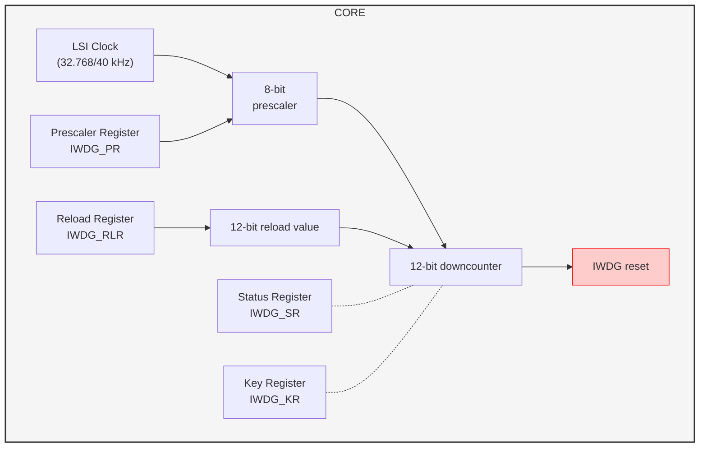
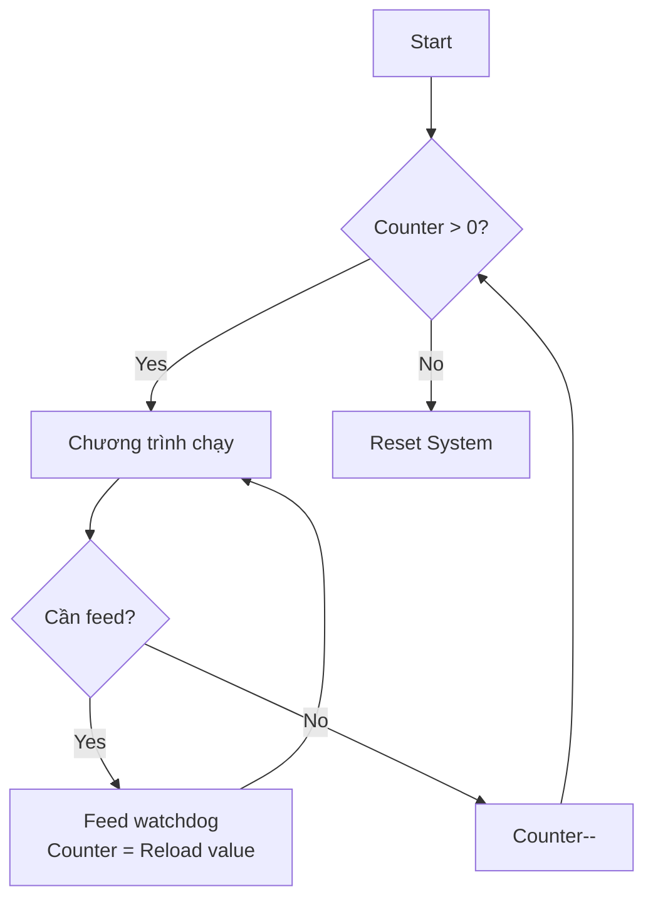

# 🔍 Learning Watchdog Timer on STM32F411

## 📚 Giới thiệu về Watchdog
Watchdog (WDG) là một bộ đếm thời gian được sử dụng để phát hiện và phục hồi từ các sự cố phần mềm. STM32F411 có 2 loại Watchdog:

### 🛡️ Independent Watchdog (IWDG)
- 🔄 Sử dụng bộ dao động LSI (32.768 kHz hoặc 40 kHz tùy phiên bản chip)
- 🔓 Hoạt động độc lập với clock chính
- ⚡ Phù hợp cho việc phục hồi từ lỗi phần mềm

### 🎯 Cấu trúc IWDG

```mermaid
graph TD
    subgraph CORE["CORE"]
        PR["Prescaler Register<br/>IWDG_PR"]
        SR["Status Register<br/>IWDG_SR"]
        RLR["Reload Register<br/>IWDG_RLR"]
        KR["Key Register<br/>IWDG_KR"]
        LSI["LSI Clock<br/>(32.768/40 kHz)"]
        PS["8-bit<br/>prescaler"]
        RV["12-bit reload value"]
        DC["12-bit downcounter"]
        RESET["IWDG reset"]

        LSI --> PS
        PR --> PS
        PS --> DC
        RLR --> RV
        RV --> DC
        DC --> RESET
        SR -.- DC
        KR -.- DC
    end

    style CORE fill:#f5f5f5,stroke:#333,stroke-width:2px
    style RESET fill:#ffcccc,stroke:#ff0000
```

### ⚠️ Lưu ý về tần số LSI
- LSI có thể là 32.768 kHz hoặc 40 kHz tùy phiên bản chip
- Công thức tính timeout cần điều chỉnh theo tần số thực tế:
```c
// Với LSI = 32.768 kHz
Timeout = (IWDG_RLR × Prescaler) / 32768

// Với LSI = 40 kHz
Timeout = (IWDG_RLR × Prescaler) / 40000
```

### 📝 Ví dụ tính timeout
1. LSI = 32.768 kHz:
   - Prescaler = 32, RLR = 4095
   - Timeout = (4095 × 32) / 32768 = 4 giây

2. LSI = 40 kHz:
   - Prescaler = 32, RLR = 4095
   - Timeout = (4095 × 32) / 40000 = 3.276 giây

### 🪟 Window Watchdog (WWDG)
- 🔄 Sử dụng bộ dao động HSI
- ⏰ Sử dụng clock từ APB1
- 📊 Có thể cấu hình cửa sổ thời gian
- 🎯 Phát hiện lỗi thời gian thực chính xác hơn

---

## 💤 Low Power Modes

STM32F411 cung cấp 3 chế độ tiết kiệm điện:

### 1. 😴 Sleep Mode
- CPU và Cortex®-M4F core bị dừng
- Các ngoại vi vẫn hoạt động
- Thích hợp cho việc tiết kiệm điện nhẹ
- Thời gian wake-up nhanh

### 2. 🛑 Stop Mode
- Tất cả clock đều bị dừng
- Giữ nội dung SRAM và thanh ghi
- Tiết kiệm điện đáng kể
- Thời gian wake-up trung bình

### 3. 🔌 Standby Mode
- Tắt nguồn domain 1.2V
- Mất nội dung SRAM và thanh ghi
- Tiết kiệm điện tối đa
- Thời gian wake-up lâu nhất

### ⚡ Watchdog trong Low Power Mode
1. **IWDG**:
   - Tiếp tục hoạt động trong mọi chế độ
   - Sử dụng LSI nên độc lập với system clock
   - Có thể đánh thức hệ thống từ Sleep/Stop

2. **WWDG**:
   - Dừng trong Stop và Standby mode
   - Hoạt động trong Sleep mode nếu APB1 clock được bật
   - Không thể đánh thức hệ thống từ Stop/Standby

## ⚖️ So sánh IWDG và WWDG

| Đặc điểm | 🛡️ IWDG | 🪟 WWDG |
|----------|----------|---------|
| Clock | LSI (40 kHz) | APB1 (max 42 MHz) |
| Counter | 12-bit | 7-bit |
| Prescaler | 4 → 256 | 1, 2, 4, 8 |
| Timeout | 0.1ms → 26.2s | Theo APB1 clock |
| Cửa sổ thời gian | ❌ | ✅ |
| Ngắt cảnh báo | ❌ | ✅ |
| Low Power Mode | Hoạt động tất cả mode | Chỉ Sleep mode |
| Ứng dụng | Bảo vệ treo hệ thống | Giám sát timing |

## 🚀 Ứng dụng thực tế
1. **🔄 Phục hồi từ treo phần mềm**
   - 🛡️ Sử dụng IWDG để reset hệ thống
   - ⏱️ Thời gian timeout phù hợp với chu kỳ task

2. **📊 Giám sát thời gian thực**
   - 🪟 Sử dụng WWDG để đảm bảo timing
   - 🎯 Cấu hình cửa sổ cho phép refresh

3. **💪 Kết hợp cả hai**
   - 🛡️ IWDG cho bảo vệ tổng thể
   - 🔍 WWDG cho giám sát chi tiết

## 📝 Notes
- ✅ Luôn test watchdog trước khi triển khai
- ⚠️ Tính toán timeout dựa trên worst-case scenario
- 🎯 Đặt refresh point ở vị trí thích hợp
- 🌡️ Xem xét điều kiện môi trường ảnh hưởng tới LSI
- 💾 Backup dữ liệu quan trọng trước khi reset
- ⚡ Xử lý ngắt WWDG một cách phù hợp

## 🚨 HardFault Handler

### ⚡ Giới thiệu
HardFault là exception handler mức độ cao nhất, được gọi khi có lỗi nghiêm trọng trong chương trình.
thường khi vào hardfault thì bị treo trong while(1).

### 🔍 Các nguyên nhân chính
1. **Lỗi truy cập bộ nhớ**
   - Truy cập vùng nhớ không được phép
   - Truy cập địa chỉ không căn chỉnh (unaligned access)
   - Truy cập ngoài vùng nhớ Stack

2. **Lỗi thực thi**
   - Chia cho 0
   - Lệnh không hợp lệ
   - Truy cập thanh ghi không tồn tại

3. **Lỗi Bus**
   - Lỗi truy cập peripheral
   - Timeout khi truy cập bus
   - Lỗi đọc/ghi peripheral

4. **Lỗi Exception**
   - Exception lồng nhau quá sâu
   - Trả về từ exception handler không đúng
   - Exception priority không hợp lệ

### 💻 Ví dụ code gây HardFault
```c
// 1. Chia cho 0
int x = 0;
int y = 1/x;  // -> HardFault

// 2. Truy cập con trỏ NULL
int* ptr = NULL;
*ptr = 100;   // -> HardFault

// 3. Truy cập địa chỉ không căn chỉnh
int* unaligned = (int*)0x20000001; // Địa chỉ lẻ
*unaligned = 100;  // -> HardFault

// 4. Tràn stack
void recursive() {
    int arr[1000];
    recursive();  // -> Stack overflow -> HardFault
}
```

### 🛠️ Xử lý HardFault
1. **Cách 1: Sử dụng Watchdog**
```c
void main() {
    IWDG_Init(IWDG_PRESCALER_32, 1000); // 1s timeout
    
    while(1) {
        IWDG_Refresh();
        // Nếu có HardFault -> không refresh -> reset
    }
}
```

2. **Cách 2: Custom HardFault Handler**
```c
void HardFault_Handler(void) {
    // 1. Lưu thông tin lỗi
    // 2. Reset hệ thống hoặc xử lý phục hồi
    NVIC_SystemReset();
}
```

### ⚠️ Phòng tránh HardFault
1. **Kiểm tra đầu vào**
```c
void divide(int x) {
    if(x != 0) {
        int result = 1/x;
    }
}
```

2. **Kiểm tra con trỏ**
```c
void write_data(int* ptr) {
    if(ptr != NULL) {
        *ptr = 100;
    }
}
```

3. **Kiểm tra vùng nhớ**
```c
#define BUFFER_SIZE 100
void write_buffer(int index, int value) {
    if(index < BUFFER_SIZE) {
        buffer[index] = value;
    }
}
```

## 🔄 Feed Watchdog

### ⚡ Khái niệm
Feed watchdog (hay Refresh watchdog) là việc nạp lại giá trị đếm của watchdog timer để ngăn nó reset hệ thống.

### 🎯 Cách hoạt động

```mermaid
graph TD
    A[Start] --> B{Counter > 0?}
    B -->|Yes| C[Chương trình chạy]
    C --> D{Cần feed?}
    D -->|Yes| E[Feed watchdog<br/>Counter = Reload value]
    E --> C
    D -->|No| F[Counter--]
    F --> B
    B -->|No| G[Reset System]
```

### 💡 Nguyên tắc Feed Watchdog
1. **Thời điểm feed**
   - Feed định kỳ trước khi counter = 0
   - Với WWDG: Feed trong cửa sổ cho phép
   - Không feed quá sớm hoặc quá muộn

2. **Vị trí đặt lệnh feed**
   - Trong main loop
   - Sau khi hoàn thành task quan trọng
   - Trong task định kỳ của RTOS
   ```c
   while(1) {
       // Tasks quan trọng
       important_task();
       
       // Feed watchdog
       IWDG_Refresh();
       
       // Tasks không quan trọng
       normal_task();
   }
   ```

3. **Trường hợp KHÔNG feed**
   - Trong ngắt (ISR)
   - Trong critical section
   - Khi đang xử lý lỗi
   ```c
   void error_handler(void) {
       // KHÔNG feed watchdog
       // Để hệ thống tự reset
       while(1);
   }
   ```

### ⚠️ Lỗi thường gặp
1. **Feed quá thường xuyên**
```c
while(1) {
    IWDG_Refresh();  // BAD: Không phát hiện được treo
    if(error) {
        // Không bao giờ reset vì feed liên tục
    }
}
```

2. **Feed không đều**
```c
while(1) {
    heavy_task();    // Task có thời gian không ổn định
    IWDG_Refresh();  // Có thể bị trễ -> reset ngoài ý muốn
}
```

3. **Feed trong HardFault**
```c
void HardFault_Handler(void) {
    IWDG_Refresh();  // BAD: Không nên feed
    while(1);        // Hệ thống sẽ bị treo
}
```

### ✅ Cách Feed đúng
1. **Feed có điều kiện**
```c
while(1) {
    if(system_is_healthy()) {
        IWDG_Refresh();
    }
    run_tasks();
}
```

2. **Feed với RTOS**
```c
void watchdog_task(void *arg) {
    while(1) {
        IWDG_Refresh();
        osDelay(WATCHDOG_PERIOD);
    }
}
```

3. **Feed với state machine**
```c
void main(void) {
    IWDG_Init(IWDG_PRESCALER_32, 1000);
    
    while(1) {
        switch(system_state) {
            case NORMAL:
                run_normal_tasks();
                IWDG_Refresh();
                break;
                
            case ERROR:
                // Không feed -> để hệ thống reset
                handle_error();
                break;
        }
    }
}
```

## 🔑 IWDG Key Values

### ⚡ Các giá trị key của IWDG
| Key | Giá trị | Chức năng |
|-----|----------|-----------|
| KEY_RELOAD | 0xAAAA | Nạp lại giá trị counter |
| KEY_ENABLE | 0xCCCC | Kích hoạt IWDG |
| KEY_WRITE | 0x5555 | Cho phép ghi vào thanh ghi PR/RLR |
| KEY_PROTECT | Khác | Bảo vệ thanh ghi (không cho ghi) |

### 💡 Giải thích chi tiết
1. **0xAAAA - KEY_RELOAD**
   - Dùng để feed (refresh) watchdog
   - Nạp lại giá trị từ RLR vào counter
   - Ngăn watchdog reset hệ thống
   ```c
   IWDG->KR = 0xAAAA;  // Refresh counter
   ```

2. **0xCCCC - KEY_ENABLE**
   - Kích hoạt IWDG hoạt động
   - Sau khi enable không thể disable
   - Counter bắt đầu đếm ngược
   ```c
   IWDG->KR = 0xCCCC;  // Start watchdog
   ```

3. **0x5555 - KEY_WRITE**
   - Mở khóa để ghi cấu hình
   - Cho phép truy cập PR và RLR
   - Hiệu lực trong thời gian ngắn
   ```c
   IWDG->KR = 0x5555;  // Unlock registers
   IWDG->PR = pr;      // Set prescaler
   IWDG->RLR = rlr;    // Set reload value
   ```

### ⚠️ Lưu ý quan trọng
1. **Thứ tự cấu hình**
```c
void IWDG_Init(uint8_t pr, uint16_t rlr) {
    IWDG->KR = 0x5555;  // 1. Unlock first
    IWDG->PR = pr;      // 2. Set prescaler
    IWDG->RLR = rlr;    // 3. Set reload
    IWDG->KR = 0xAAAA;  // 4. Reload counter
    IWDG->KR = 0xCCCC;  // 5. Start IWDG
}
```

2. **Timing quan trọng**
```c
// Sau khi write 0x5555
// Phải cấu hình xong trước khi hết T_PVU và T_RVU
if((IWDG->SR & IWDG_SR_PVU) == 0) {  // Check PR ready
    IWDG->PR = pr;
}
if((IWDG->SR & IWDG_SR_RVU) == 0) {  // Check RLR ready
    IWDG->RLR = rlr;
}
```

3. **Không thể disable**
```c
// WRONG: Không thể tắt IWDG sau khi enable
IWDG->KR = 0xCCCC;  // Enable
// ... some code ...
IWDG->KR = 0x0000;  // Trying to disable -> Không có tác dụng
```

### 🔒 Cơ chế bảo vệ
1. **Write Protection**
   - Thanh ghi chỉ có thể ghi khi unlock
   - Tự động khóa sau một thời gian
   - Ngăn thay đổi cấu hình ngoài ý muốn

2. **Key Sequence**
   - Phải ghi đúng giá trị key
   - Các giá trị khác bị bỏ qua
   - Bảo vệ khỏi ghi nhầm/nhiễu
