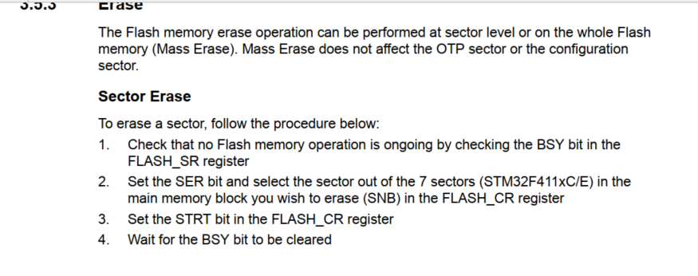
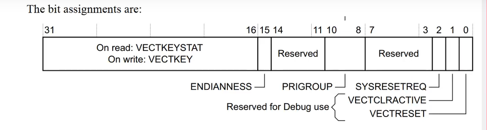

## STM32 Bootloader

Bootloader là một chương trình được lưu trữ trong bộ nhớ ROM của STM32, cho phép nạp và cập nhật firmware thông qua nhiều giao thức khác nhau.

1. Khái niệm cơ bản
   - Bootloader là chương trình đầu tiên chạy khi MCU khởi động
   - Nằm trong System Memory (Boot ROM)
   - Cho phép lập trình/cập nhật firmware qua nhiều giao tiếp:
     * USART
     * I2C
     * SPI
     * USB
     * CAN




``FW1:`` gọi là bootloader là firmware mà khi mình cấp điện cho nó thì nó sẽ là thằng chạy đầu tiên để config hoặc lựa chọn firmware để thực hiện, mình viết để nó nhảy vào app1 và app2
``FW2:`` gọi là app1
``FW3:`` gọi là app2

2. Cơ chế hoạt động
   ```
   ┌─────────────────┐
   │   Reset MCU     │
   └────────┬────────┘
            │
   ┌────────▼────────┐
   │  Kiểm tra BOOT  │
   │     pins        │
   └────────┬────────┘
            │
   ┌────────▼────────┐         ┌─────────────────┐
   │  Boot Mode      │──Yes--->│  Vào Bootloader │
   │  được chọn?     │         │  (System Memory)│
   └────────┬────────┘         └────────┬────────┘
            │No                         │
   ┌────────▼────────┐         ┌───────▼─────────┐
   │  Thực thi       │         │  Chờ lệnh từ   │
   │  User Program   │         │  Host (PC)      │
   └─────────────────┘         └─────────────────┘
   ```

3. Boot Pins và Boot Mode
   - BOOT0 và BOOT1 xác định nguồn boot:
     ```
     ┌────────┬────────┬──────────────────────┐
     │ BOOT1  │ BOOT0  │    Boot Mode         │
     ├────────┼────────┼──────────────────────┤
     │   X    │   0    │ User Flash Memory    │
     │   0    │   1    │ System Memory        │
     │   1    │   1    │ Embedded SRAM        │
     └────────┴────────┴──────────────────────┘
     ```

4. Thanh ghi quan trọng cho Bootloader

   a. FLASH_KEYR (0x40023C04)
      - Mở khóa Flash memory
      - Giá trị key1: 0x45670123
      - Giá trị key2: 0xCDEF89AB

   b. FLASH_SR (0x40023C0C)
      - Thanh ghi trạng thái Flash
      ```
      Bit 16 BSY: Busy bit
      Bit 7  PGSERR: Programming sequence error
      Bit 4  WRPERR: Write protection error
      Bit 3  PGAERR: Programming alignment error
      Bit 2  PGPERR: Programming parallelism error
      Bit 1  OPERR: Operation error
      Bit 0  EOP: End of operation
      ```

   c. FLASH_CR (0x40023C10)
      - Điều khiển Flash
      ```
      Bit 31 LOCK: Lock bit
      Bit 24 ERRIE: Error interrupt enable
      Bit 16 EOPIE: End of operation interrupt enable
      Bit 9:8 PSIZE: Program size
      Bit 1  SER: Sector erase
      Bit 0  PG: Programming
      ```

5. Quy trình nạp firmware qua Bootloader
   a. Kích hoạt chế độ Bootloader
      - Đặt BOOT0 = 1, BOOT1 = 0
      - Reset MCU

   b. Giao thức truyền thông
      - Bắt đầu với ACK (0x79)
      - Lệnh Get ID (0x02)
      - Lệnh Erase Memory (0x43)
      - Lệnh Write Memory (0x31)
      - Lệnh Go (0x21)

   c. Cấu trúc gói tin
      ```
      ┌────────┬────────┬──────────┬────────┬────────┐
      │  Start │  Cmd   │  Length  │  Data  │  CRC   │
      │  0x7F  │ 1 byte │  1 byte  │N bytes │ 1 byte │
      └────────┴────────┴──────────┴────────┴────────┘
      ```

6. Bảo vệ Bootloader
   - Read Protection Level (RDP)
     * Level 0: Không bảo vệ
     * Level 1: Bảo vệ một phần
     * Level 2: Bảo vệ hoàn toàn

   - Write Protection
     * Bảo vệ từng sector
     * Cấu hình qua Option Bytes

7. Ví dụ mã nguồn kích hoạt Bootloader
   ```c
   // Hàm nhảy vào Bootloader
   void JumpToBootloader(void) {
       void (*SysMemBootJump)(void);
       
       // Vô hiệu hóa tất cả ngắt
       __disable_irq();
       
       // Reset tất cả ngoại vi
       HAL_DeInit();
       
       // Đặt địa chỉ System Memory
       SysMemBootJump = (void (*)(void)) *((uint32_t *)(0x1FFF0000 + 4));
       
       // Đặt Stack Pointer
       __set_MSP(*(uint32_t *)0x1FFF0000);
       
       // Nhảy vào Bootloader
       SysMemBootJump();
   }
   ```

8. Lưu ý quan trọng
   - Luôn sao lưu firmware trước khi thao tác với Bootloader
   - Cẩn thận với RDP Level 2 (không thể quay lại)
   - Kiểm tra tính toàn vẹn firmware sau khi nạp
   - Đảm bảo nguồn điện ổn định trong quá trình nạp
   - Xử lý timeout cho các thao tác bootloader

## Tài liệu tham khảo bổ sung

- [AN2606 - STM32 microcontroller system memory boot mode](https://www.st.com/resource/en/application_note/cd00167594-stm32-microcontroller-system-memory-boot-mode-stmicroelectronics.pdf)  
  *Ghi chú: Chi tiết về bootloader và các giao thức truyền thông*

- [AN3155 - USART protocol used in the STM32 bootloader](https://www.st.com/resource/en/application_note/cd00264342-usart-protocol-used-in-the-stm32-bootloader-stmicroelectronics.pdf)  
  *Ghi chú: Đặc tả chi tiết giao thức USART trong bootloader*

## Thuật ngữ và Giải thích Tiếng Việt

Phần này giải thích các thuật ngữ kỹ thuật thường gặp trong lập trình STM32 bằng tiếng Việt.

1. Thuật ngữ về Bộ nhớ
   - Flash Memory (Bộ nhớ Flash)
     * Bộ nhớ không bay hơi, lưu trữ chương trình
     * Có thể xóa và ghi lại nhiều lần
     * Tốc độ truy cập chậm hơn RAM

   - RAM (Random Access Memory - Bộ nhớ truy cập ngẫu nhiên)
     * Bộ nhớ tạm thời, mất dữ liệu khi mất điện
     * Tốc độ truy cập nhanh
     * Dùng để lưu biến và dữ liệu tạm thời

   - ROM (Read Only Memory - Bộ nhớ chỉ đọc)
     * Chứa bootloader và các chương trình hệ thống
     * Không thể thay đổi nội dung
     * Được lập trình sẵn từ nhà sản xuất

2. Thuật ngữ về Ngoại vi
   - GPIO (General Purpose Input/Output - Đầu vào/ra đa năng)
     * Chân tín hiệu số có thể cấu hình là input hoặc output
     * Có thể cấu hình pull-up/pull-down
     * Hỗ trợ ngắt ngoài

   - UART (Universal Asynchronous Receiver-Transmitter)
     * Giao tiếp nối tiếp không đồng bộ
     * Truyền nhận dữ liệu theo byte
     * Thường dùng để debug và giao tiếp với máy tính

   - ADC (Analog to Digital Converter - Bộ chuyển đổi tương tự số)
     * Chuyển đổi tín hiệu analog thành số
     * Độ phân giải từ 8-bit đến 12-bit
     * Có thể đọc nhiều kênh

3. Thuật ngữ về Hệ thống
   - Clock (Xung nhịp)
     * Tín hiệu định thời cho hệ thống
     * Đơn vị đo: Hz (Hertz)
     * Ảnh hưởng đến tốc độ xử lý và tiêu thụ điện

   - Reset (Khởi động lại)
     * Đưa hệ thống về trạng thái ban đầu
     * Có nhiều nguồn reset: phần cứng, phần mềm, watchdog
     * Reset toàn bộ hoặc từng phần

   - Interrupt (Ngắt)
     * Tín hiệu yêu cầu CPU tạm dừng chương trình hiện tại
     * Thực hiện một công việc ưu tiên
     * Có thể cấu hình độ ưu tiên

4. Thuật ngữ về Lập trình
   - Register (Thanh ghi)
     * Vùng nhớ đặc biệt trong CPU hoặc ngoại vi
     * Điều khiển hoạt động của phần cứng
     * Truy cập trực tiếp qua địa chỉ

   - Pointer (Con trỏ)
     * Biến chứa địa chỉ của biến khác
     * Dùng để truy cập phần cứng
     * Quan trọng trong lập trình nhúng

   - Callback (Hàm gọi lại)
     * Hàm được gọi khi có sự kiện xảy ra
     * Thường dùng trong xử lý ngắt
     * Không được chạy quá lâu

5. Thuật ngữ về Debug
   - Breakpoint (Điểm dừng)
     * Vị trí dừng chương trình để kiểm tra
     * Có thể đặt nhiều điểm dừng
     * Xem giá trị biến tại thời điểm dừng

   - Watch (Theo dõi)
     * Theo dõi giá trị biến trong quá trình debug
     * Cập nhật theo thời gian thực
     * Hỗ trợ nhiều định dạng hiển thị

   - Trace (Theo vết)
     * Ghi lại quá trình thực thi chương trình
     * Phân tích thời gian thực thi
     * Tìm lỗi khó phát hiện

6. Các Lỗi Thường Gặp
   - Hard Fault
     * Lỗi nghiêm trọng của hệ thống
     * Thường do truy cập bộ nhớ không hợp lệ
     * Cần reset hệ thống để phục hồi

   - Stack Overflow
     * Tràn vùng nhớ stack
     * Do đệ quy quá sâu hoặc biến cục bộ quá lớn
     * Có thể gây hard fault

   - Bus Fault
     * Lỗi truy cập bus
     * Do địa chỉ không hợp lệ
     * Thường xảy ra khi cấu hình sai ngoại vi

7. Quy tắc Lập trình An toàn
   - Atomic Operation (Thao tác nguyên tử)
     * Thao tác không bị ngắt quãng
     * Quan trọng trong xử lý ngắt
     * Đảm bảo tính nhất quán dữ liệu

   - Critical Section (Đoạn găng)
     * Đoạn code không được phép bị ngắt
     * Cần bảo vệ bằng cách tắt/bật ngắt
     * Giữ càng ngắn càng tốt

   - Race Condition (Tình trạng đua)
     * Lỗi do truy cập đồng thời vào tài nguyên
     * Thường xảy ra giữa ngắt và chương trình chính
     * Khó phát hiện và debug

8. Công cụ Phát triển
   - IDE (Integrated Development Environment)
     * Môi trường phát triển tích hợp
     * Bao gồm editor, compiler, debugger
     * Ví dụ: STM32CubeIDE, Keil MDK

   - Compiler (Trình biên dịch)
     * Chuyển mã nguồn thành mã máy
     * Tối ưu hóa code
     * Phát hiện lỗi cú pháp

   - Debugger (Trình gỡ lỗi)
     * Công cụ tìm và sửa lỗi
     * Hỗ trợ breakpoint, watch, trace
     * Kết nối qua ST-Link hoặc J-Link

## Lưu ý khi sử dụng tài liệu
- Các thuật ngữ tiếng Anh được giữ nguyên kèm giải thích tiếng Việt để dễ đối chiếu
- Một số thuật ngữ chuyên ngành có thể chưa có từ tiếng Việt tương đương chính xác
- Nên tham khảo thêm tài liệu gốc bằng tiếng Anh để hiểu rõ hơn

