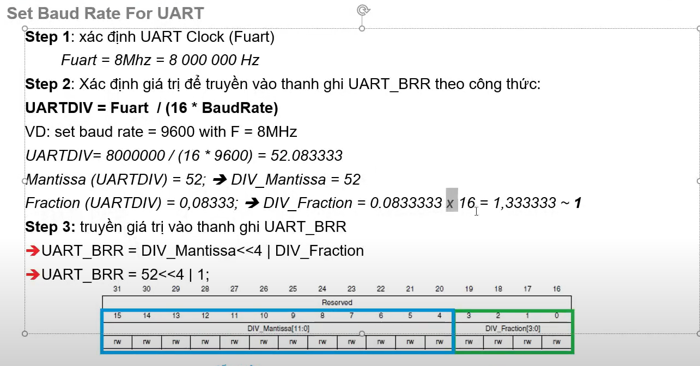

### Bài 1: GPIO (General Purpose Input/Output)

1. Tổng quan về GPIO
   - GPIO là gì?
     * Các chân vào/ra đa năng
     * Có thể cấu hình là input hoặc output
     Input có các chể độ:
     
     Output có các chế độ:
     
     * Điều khiển/đọc tín hiệu số (0V hoặc 3.3V)
   
   - Các tính năng của GPIO
     * Cấu hình được input/output
     * Push-pull hoặc open-drain output
     * Pull-up/pull-down internal resistors
     * Tốc độ đóng mở có thể cấu hình
     * Alternate function (kết nối với các ngoại vi khác)

2. Cấu trúc GPIO
   - Mỗi PORT có 16 chân (PIN0 đến PIN15)
   - Mỗi PIN có các thanh ghi điều khiển:
     * MODE: Input/Output/Alternate/Analog
     * TYPE: Push-pull/Open-drain
     * SPEED: Low/Medium/High/Very high
     * PULL: No pull/Pull-up/Pull-down
     * IDR: Input Data Register
     * ODR: Output Data Register
     * BSRR: Bit Set/Reset Register

3. Các bước lập trình GPIO
   a. Enable clock cho GPIO port
      * Sử dụng thanh ghi RCC_AHB1ENR
      * Set bit tương ứng với PORT cần dùng
   
   b. Cấu hình MODE (Input/Output)
      * Sử dụng GPIOx_MODER
      * 00: Input mode
      * 01: Output mode
      * 10: Alternate function
      * 11: Analog mode
   
   c. Cấu hình Output Type (nếu là output)
      * Sử dụng GPIOx_OTYPER
      * 0: Push-pull
      * 1: Open-drain
   
   d. Cấu hình Pull-up/Pull-down (nếu cần)
      * Sử dụng GPIOx_PUPDR
      * 00: No pull-up/pull-down
      * 01: Pull-up
      * 10: Pull-down
   
   e. Điều khiển GPIO
      * Đọc input: GPIOx_IDR
      * Ghi output: GPIOx_ODR hoặc GPIOx_BSRR

4. Ví dụ thực hành
   - Điều khiển LED
     * Cấu hình GPIO là output
     * Sử dụng push-pull mode
     * Điều khiển bằng BSRR để bật/tắt LED
   
   - Đọc nút nhấn
     * Cấu hình GPIO là input
     * Sử dụng pull-up hoặc pull-down
     * Đọc trạng thái từ IDR

5. Lưu ý quan trọng
   - Luôn enable clock trước khi cấu hình
   - Cẩn thận với điện áp và dòng điện tối đa
   - Không để pin ở trạng thái floating
   - Sử dụng BSRR thay vì ODR để atomic access

**Note:** 
- Trong diện tử digital mức 0 và mức 1 theo tiêu chuẩn TTL (0: 0- 0.8V, 1: 2.4 - VCC).
- Điện chảy từ nói có điện áp cao về nơi có điện áp thấp.
